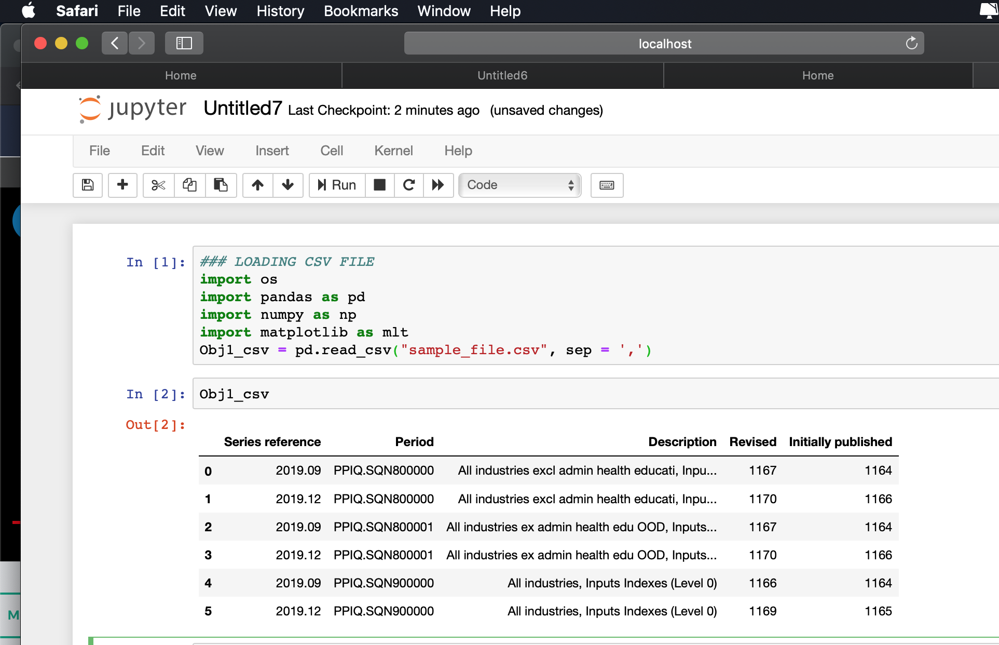
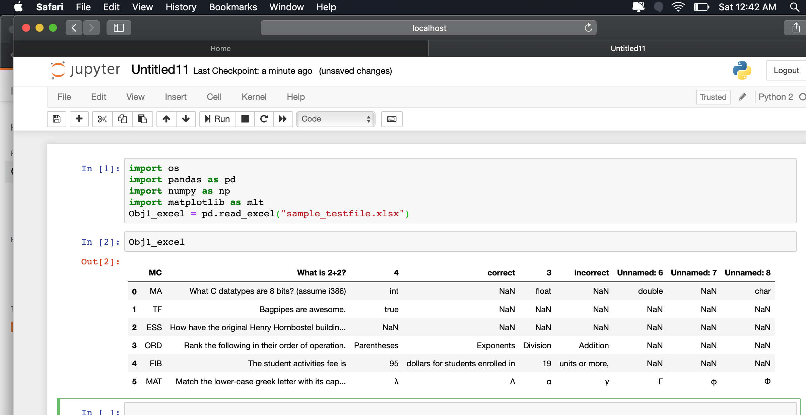
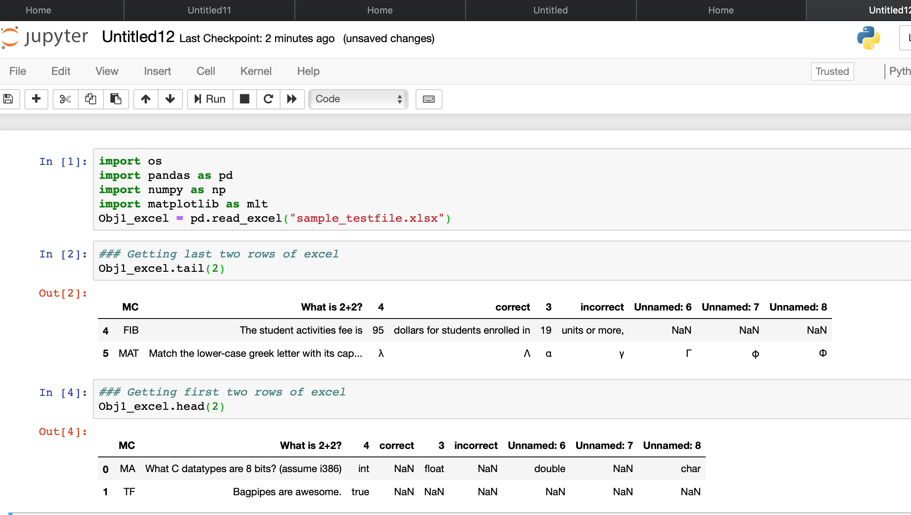
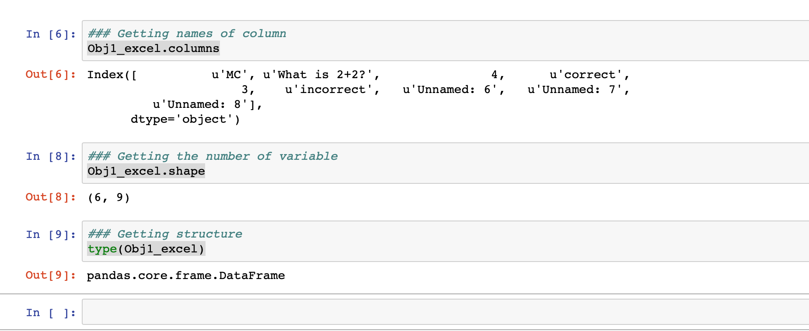

Lets see some more commands here. 
### Load CSV File
import os  
import pandas as pd  
import numpy as np  
import matplotlib as mlt  
Obj1_csv = pd.read_csv("sample_file.csv", sep = ',')  
#### Screenshot for above commands
I have saved a sample_file.csv with few rows under bin directory, which was assigned to Obj1_csv object and then it was read using Obj1_csv. Check out below.

### Read Excel File
Before proceeding this, install xlrd package under bin, using below command. Else you will get an import error.  
pip install xlrd  //Installing xlrd
Now below is the command to read excel file.  
Obj1_excel = pd.read_excel("Filename.xls")     
#### Screenshot for above commands
  
Note: - Files that you would like to read to be placed under the bin directory  where your python is installed.
### Getting first and last n number of rows.
Obj1_excel.head(3) - will give first three rows    
Obj1_excel.tail(3) - will give last three rows   
Obj1_excel (Its the object name in which excel file is loaded)  
#### Screenshot for above commands
  
### Getting number and names of variables(colums) and type
Obj1_excel.columns- Gives the column names  
Obj1_excel.shape- Gives number of rows and columns   
type(Obj1_excel)- Gives type/structure  
#### Screenshot for above commands

With this we will end this page, More and more commands are in line.. We will catch up soon!!!