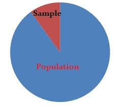
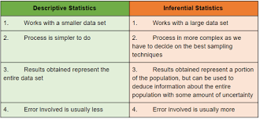
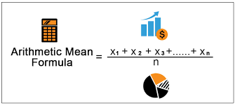
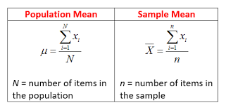
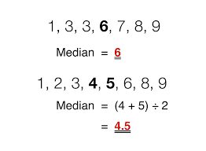
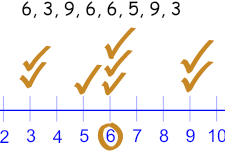

In previous page, we covered Introduction and all basic information. From this page we actually enter into the course.Topics to be covered in this page
- What is statistics
- Use of Statistics in Data Science
- Types of Statistics
- Descriptive Statistics
- Inferential Statistics
- Difference between Descriptive and Inferential Statistics
- Mean, Median, Mode

Before proceeding, let us understand the term "sample"  and "population"
as we are going to use all over here.

### Population
The entire raw data taken for analysis is called as population. 

There are two types of population.
- Finite population (limited amount of data)
Example- Employees of the company
- Infinite population (unlimited amount of data)
Example- Streaming of Data- Twitter Mining

### Sample
Subset of population is called as Sample. It is very difficult to study the entire population. So sample has been collected and analysed. The selected sample should reflect the entire population.

There are multiple method of sampling the data. Few are...
- Systematic Sample
- Analysing
- Stratified (Simple Random Selection)

Now let us start with statistics!

### What is statistics
Statistics is the way of analysing, organizing raw data to get some meaningful information. By understanding the data better we can further proceed with deep analytics ( In Simple words statistics can be used to derive meaningful insights from data by performing mathematical computations on it). There are statistical techniques available like ANOVA, Correlation,Chi Square Test. We will learn from basics and move on to ANOVA and all..

### Use of Statistics in Data Science
Data Scientists look for meaningful information from high volume of data which will be done using statistical computations. Statistics is the base for Data Science on which Analytics will be added on top of it.

### Types of Statistics
There are two types
- Descriptive Statistics 
- Inferential Statistics

### Descriptive Statistics:
It just describes the data. When we have low volume of data and when we need to describe the data, we have measures in this descriptive statistics to explain the data better. It is the first level of applying statistical technique on Raw Data to understand the meaning of it. It gives basic representation of entire population. Numerical and Graphical Technique is available in Descriptive statistis.

### Descriptive-Numerical Technique:
Key terms of this Numerical Technique are Mean, Mode, Median, Variance, Standard Deviation and Percentage. Using these terms, some better understanding of the data is achieved at the first level.

### Descriptive- Graphical Technique:
Key terms used in here are Bar Graph, Scatter Plot, Histogram, Pie chart,Line chart and graphical representation of Data to understand the data better.
  
## Inferential statistics:
When we have high volume of data, where mathematical calculation for describing the data is no easier, we take a sample of data and analyse it. In Sample, we apply descriptive analysis (understanding the data), and then we use Inferential statistics to make judgements based on sample which will be applied to entire population. 

### Difference between Desriptive and Inferential Statistics
By explaining the difference between descriptive and inferential, we can have a better understanding! Descriptive statistics uses the data to provide descriptions of the population, either through numerical calculations or graphs or tables. Inferential statistics makes inferences and predictions about a population based on a sample of data taken from the population.

###  Statistics - Fields:
Statistics has been used everywhere, below are some example areas..
Healthcare, Education, Business, Insurance, Marketing, Telecom

### Some Numeric Statistics Techniques
Below are few numeric Techniques, we use in Data Analysing.
- Mean
- Median
- Mode
- Variance
- Standard Deviation

### Mean
It is used to measure the center of the numerical data set.
We use Mean when the data has regular interval or ratio scaled  and the data are not skewed. 

Skewed data is nothing but,when we have 100 number of datapoints in which 90 data points are below 40 (1-40) and 10 datapoints are above 80 (80-100). If you calculate mean, for this dataset we will get between 50-60 where there are no datapoints are between 50-60. we can not get accurate central tendency for this dataset, This data is negatively skewed, because mean comes between 50-60 but most of the data points are below 40. So...
In this case we go for Median.

### Median
Median is simple another name for 50%. Below is the way to calculate Median.
- Arrange the data in ascending or descending order.
- Divide data into equal propotion.
- Take central value.

The Median is often used when the distribution of scores is either positively or negatively skewed.It is the center value where half of the data points are lesser and half of the data points are higher.

### Mode
Mode is a score that occurs most frequently in a set of data. In Data Science- statistics, Mode is primarily used with nominally scaled data. When the data has labels, example we have variable called Gender which has two labels Male and Female. This is called as Nominally scaled variable.

We will see correlation and covariance, collinearity in next post this page is extended more than expected.

