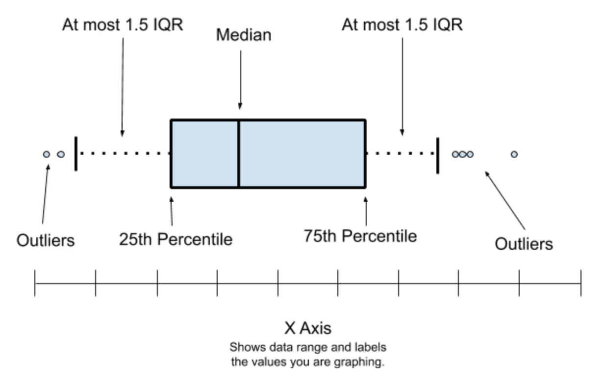

It is also part of Data Preprocessing. Outlier is an object that deviates significantly from rest of the objects which causes major change in the imputations or calculation. The analysis of Outlier Data is knowns as Outlier Analysis.   

Common Causes of Outlier
- Data Entry Errors
- Measurement Errors
- Experimental Errors
- Intentional Errors   

### Why do we detect and remove outlier??
A dataset (1,3,5,7,9) has mean 5, whereas the dataset which has outlier (1,3,5,7,14) has mean 6. Here the outlier is 14, which changes the mean itself. When the mean changes then the entire calculation based on mean will also change. This is the main reason for detecting and removing outliers.

### Ways to Detect Outliers
- BoxPlot
- Replace with NA
- R Package Outlier
#### Some Statistical Technique
- Grubb's Test for Outlier
- Dixon's Test
- Rosner's Test  

## BoxPlot 
We have inner fence and Outer fence in Boxplot. Check out the images below.  
   
   

The data points which deviates from the inner and outer fence are called as outliers.

## Replace with NA
We detect the outlier and replace the outliers with NA and consider as missing value analysis. And then we will proceed with imputations. 

## R Package Outlier
R has a package which calculates Mean of the dataset and check each value and detect the value which is away from mean and consider it as Outlier. 

Hope this post explains about Outlier and we will move with BoxPlot Outlier Analysis in R with our next post.

- 
