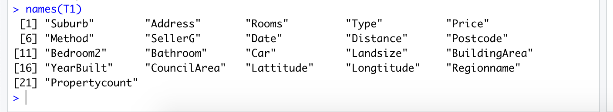

We are going to do missing value analysis on a dataset. Its going to be full of R commands.

##Load Required Libraries
x = c ("ggplot2", "corrgram", "DMwR", "caret", "randomForest", "unbalanced", "C50", "dummies", "e1071", "Information", "MASS", "rpart", "gbm", "ROSE")    

Note :- DMwR - This library is required for KNN imputation

## Set Working Directory
setwd("/Users/mac/Downloads/")  

## Read Data
T1=read.csv("melb_data.csv",  header = T, na.strings =  c(" ","","NA"))   
Note:- na.strings- The na.strings parameter of the read function can be used to tell R which symbols/characters need to be treated as NA values   

## Screenshot for above commands

##List the column names
names(T1)  

## Explore the data
str(T1)  

##Create Dataframe with missing percentage
missing_val = data.frame(apply(T1, 2, function(x) {sum(is.na(x))}))  

## Viewing the dataframe created
View(missing_val)

##Convert row names into column
missing_val$columns = row.names(missing_val)//Adding row names into a separate column
row.names(missing_val) = NULL   // Null row.names.
 

## Rename the column
names(missing_val)[1] = "missing_percentage" // Rename the first column as missing percentage 

## Calculate percentage
missing_val$missing_percentage = (missing_val$missing_percentage / nrow(T1)) *100 
##Arrange in descending order
missing_val = missing_val[order(-missing_val$missing_percentage),]   
## View in ascending order after percentage calculation 
View(missing_val)

##Rearranging the columns
missing_val = missing_val[,c(2,1)]

## write the output results back into the disk
write.csv(missing_val, “Missing_perc.csv”,  row.names = F)

Below are three methods of missing value analysis.
Now, take one value and remove it manually and impute all three methods and identify which method value gets closer to actual value and fix the method for analysis. 

Now I am checking "YearBuilt" variable, 81th row and 16th column.  and the answer is below.  
 

Now i am manually making it as NA and going to compute all three methods
 

##Mean Method
T1$YearBuilt[is.na(T1$YearBuilt)] = mean(T1$YearBuilt, na.rm = T)  
 
 
Refresh the data before proceeding to next method.
##Median Method
T1$YearBuilt[is.na(T1$YearBuilt)] = median(T1$YearBuilt, na.rm = T)  
 
##KNN  Imputation
marketing_train = knnImputation(marketing_train, k = 5)
sum(is.na(marketing_train))
 

