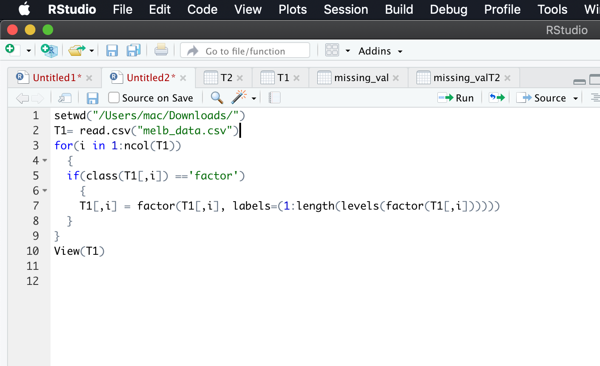
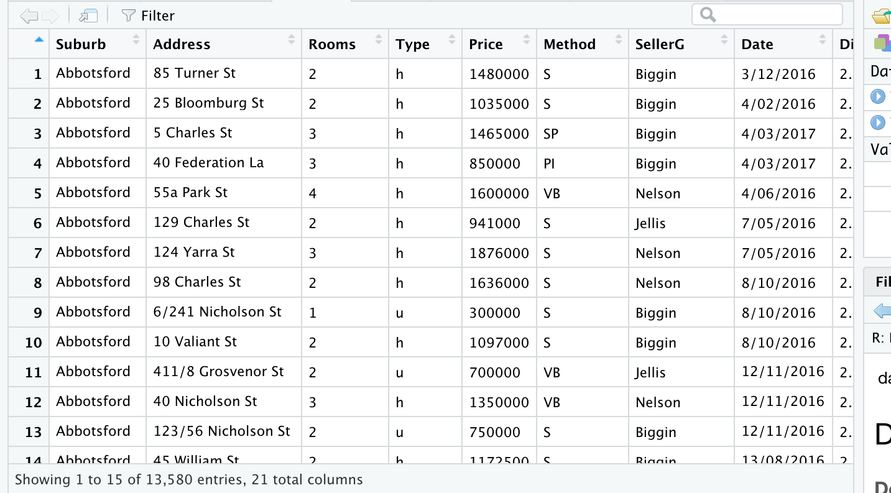
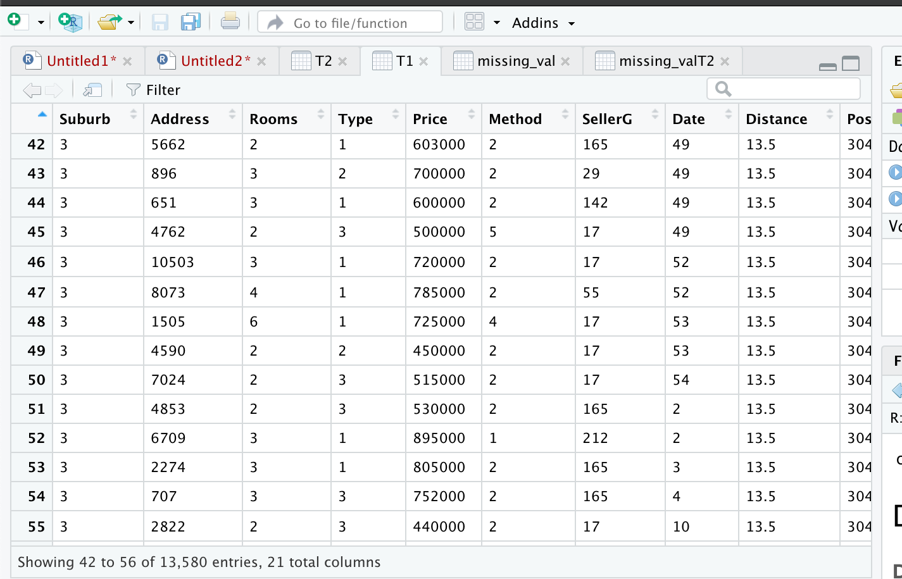
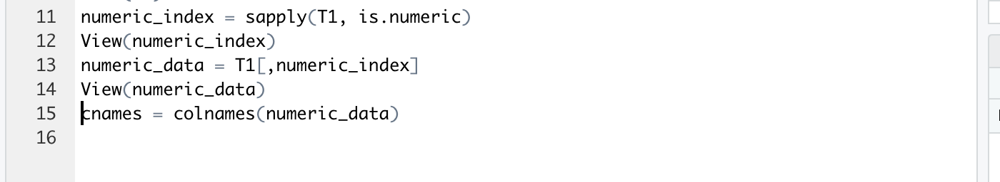
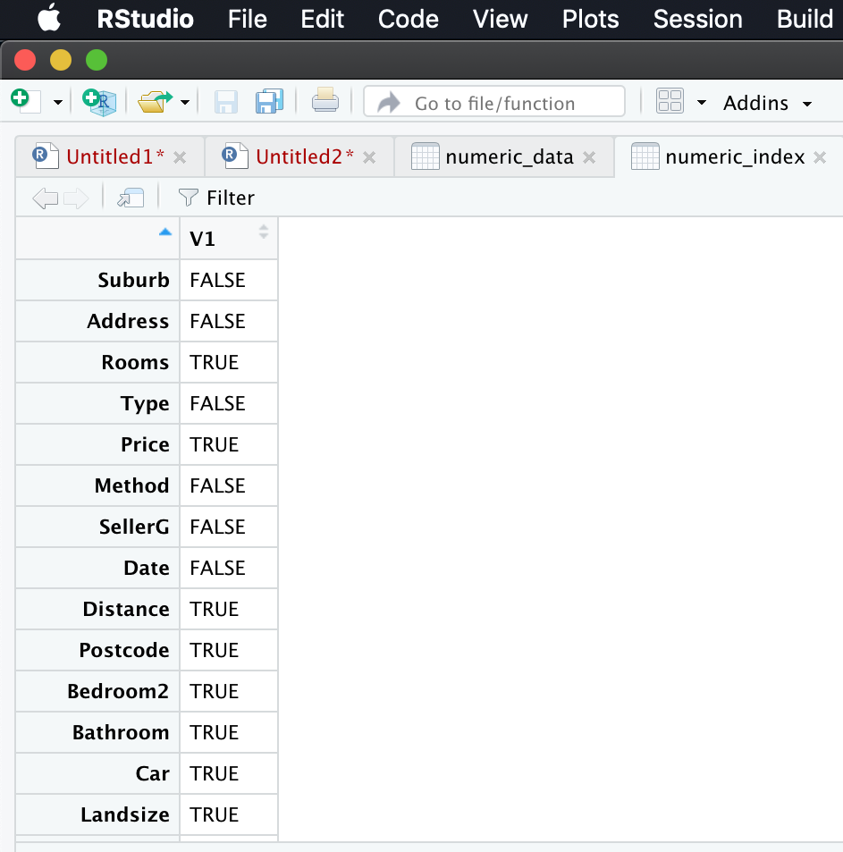
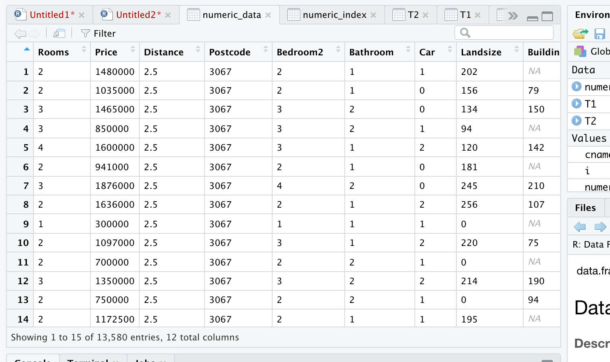
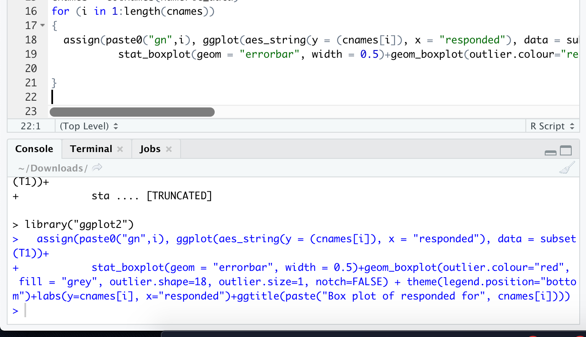
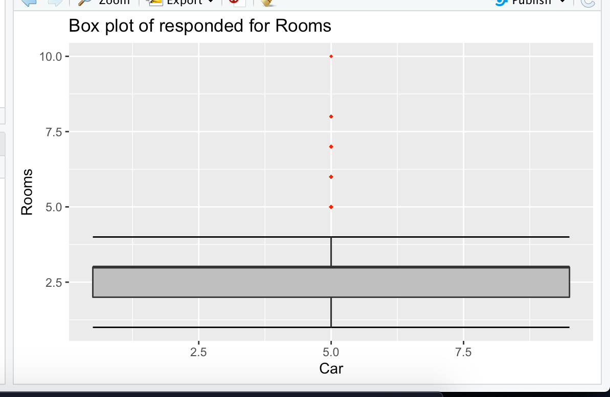

Please find the Outlier Analysis in R,
##Convert Strings into factor numeric
for(i in 1:ncol(T1))   
  {   
  if(class(T1[,i]) =='factor')   
    {   
    T1[,i] = factor(T1[,i], labels=(1:length(levels(factor(T1[,i])))))   
  }   
}    

The original csv file and the file after changing strings to factor numeric is given below to understand the difference better
  

## Outlier Analysis
## Boxplots - Distribution and Outlier Check   
## Extracting only numeric variables  
numeric_index = sapply(T1, is.numeric)   
numeric_data = T1[,numeric_index]   
view(numeric_index)     
view(numeric_data)     
cnames = colnames(numeric_data)    
   
    )
for (i in 1:length(cnames))  
{   
  assign(paste0("gn",i), ggplot(aes_string(y = (cnames[i]), x = "responded"), data = subset(T1))+
           stat_boxplot(geom = "errorbar", width = 0.5)+geom_boxplot(outlier.colour="red", fill = "grey", outlier.shape=18, outlier.size=1, notch=FALSE) + theme(legend.position="bottom")+labs(y=cnames[i], x="responded")+ggtitle(paste("Box plot of responded for", cnames[i])))  
  
}   

** Note ** 
If you get an error, could not find function ggplot, please do execute below commands.  
install.packages("ggplot2")  
library("ggplot2")  
After executing above commands, run the code.
## Plotting plots together
gridExtra::grid.arrange(gn1,ncol=1)    
Boxplot will look like below  
  

With this we will end up this. The Detailed outlier analysis will be updated later. 

Stay Tuned for 
- Feature Selection
- Feature Scaling
- Sampling Techniques
  
And we still have python implementation of all these starts from Missing Value to Sampling Techniques!!.

sssss!!!! Wait!.. And the real rollercoaster ride starts hereafter. Yes.. Machine Learning!!! Much awaited portion!!!.. stay tuned to learn :) 