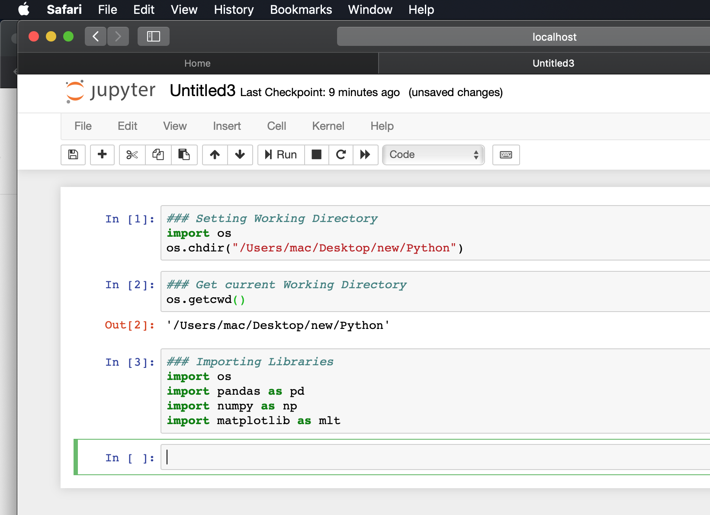
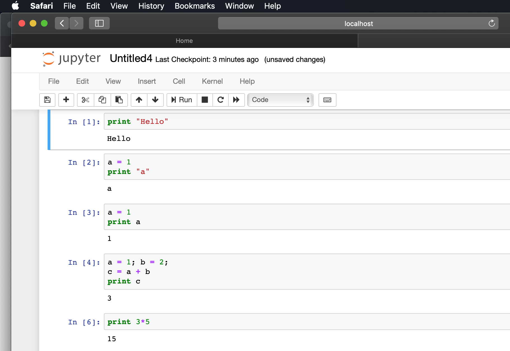
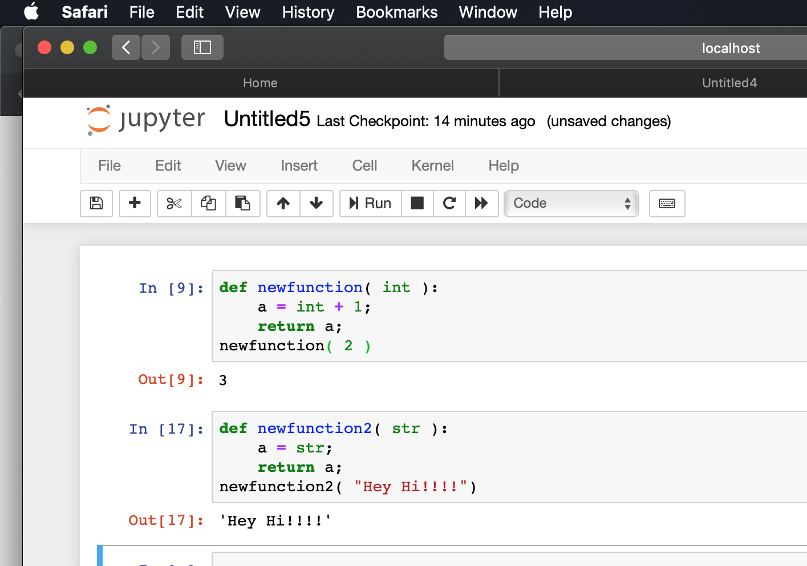

After installing python and Jupyter Notebook, now start your Jupyter notebook from the terminal which runs in port 8888 in the localhost. Now lets start with python programming.    
### Set working Directory
Before setting working directory, we have to import the respective library. Here os is the library.  
import os  
os.chdir("/Users/mac/Desktop/new/Python")   
### Get Current Working Directory
os.getcwd()
### Import Libraries
import os  
import pandas as pd  
import numpy as np  
import matplotlib as mlt  
### Screenshot for above commands

Note:- Shift+Enter to run your commands
When i tried to import pandas library, i got an error " No modules named pandas" Which i fixed by installing pandas under bin, before importing it, and below is the command.  
pip install pandas
### Using operators- Basics

### Defining function and calling the function
It is same like other programming languages, only few syntax gets varied. But its very easy to learn. Check some basic easy defining and calling functions.
Used int, and str as passing parameters. You can use any variables, using the same syntax.

There are more and more basic commands , From next post, we will start to learn commands related to DataScience like loading csv, excel files and read/write files.

