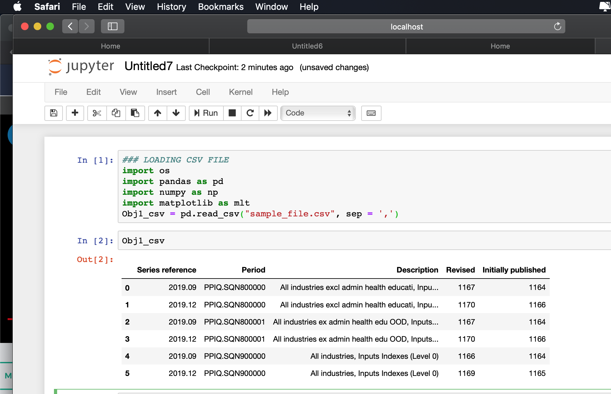
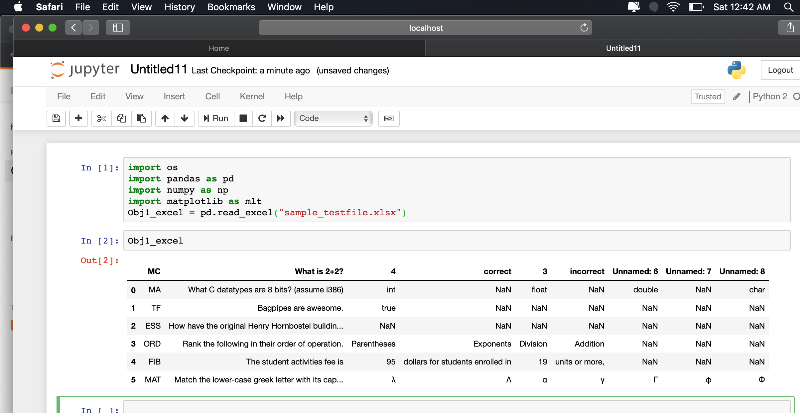
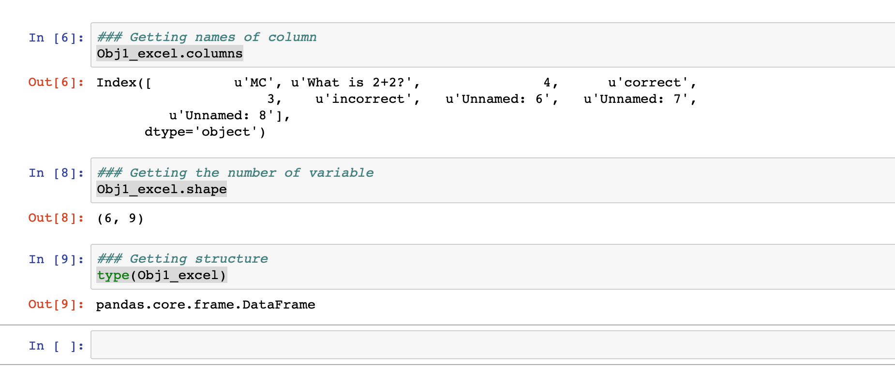

Lets see some more commands here. 
### Load CSV File
import os  
import pandas as pd  
import numpy as np  
import matplotlib as mlt  
Obj1_csv = pd.read_csv("sample_file.csv", sep = ',')  
#### Screenshot for above commands
I have saved a sample_file.csv with few rows under bin directory, which was assigned to obj1_csv object and then it was read using Obj1_csv. Check out below.

### Read Excel File
Before proceeding this, install xlrd package under bin, using below command. Else you will get an import error.  
pip install xlrd  
Now below is the command to read excel file.  
Obj1_excel = pd.read_excel("Filename.xls")     
#### Screenshot for above commands
  
Note: - Files that you would like to read to be placed under the bin directory  where your python is installed.
### Getting first and last n number of rows.
Obj1_excel.head(3) - will give first three rows    
Obj1_excel.tail(3) - will give last three rows   
Obj1_excel (Its the object name in which excel file is loaded)  
#### Screenshot for above commands
  
### Getting number and names of variables(colums) and type
Obj1_excel.columns- Gives the column names  
Obj1_excel.shape- Gives number of rows and columns   
type(Obj1_excel)- Gives type/structure  
#### Screenshot for above commands

With this we will end this page, More and more commands are in line.. We will catch up soon!!!