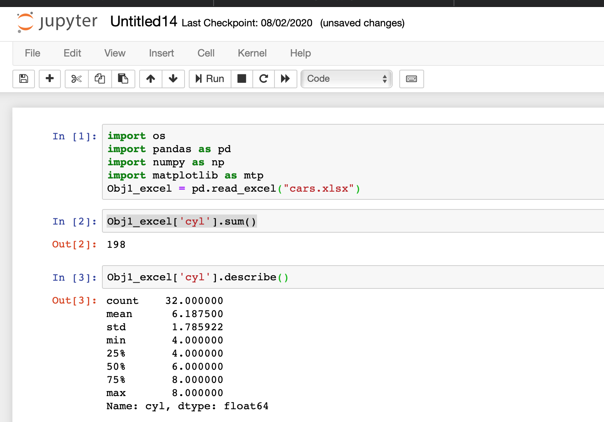

Continuing with more commands on excel operations.
### Getting n number of rows and columns
Suppose if we want to extract 3 rows with 2 columns in the excel, then below is the command.  
Obj_name.iloc[:3,:2] - Obj_name is the name where we stored our excel sheet.
#### Screenshot for above command
In the screenshot first will be the original excel data and the second will be with 3 rows and 2 columns.

I have loaded mtcars dataset(We used in R-if you remember). Since it has more numerical values, it would be helpful for us to run statistical calculations. After loading the cars.xlsx to an object, I just ran a command to check out rows and columns. Check the below. It shows 3 rows and 8 columns   
 
### Unique values in a column and its count,distribution 
Obj1_excel['cyl'].unique() -Shows unique values  
Obj1_excel['cyl'].nunique()-Shows number of unique values 
Obj1_excel['cyl'].value_counts()-Shows distribution and unique values in a particular column
#### Screenshot for above commands

### Calculate mean,median, Standard Deviation, Variance
Obj1_excel['cyl'].mean() // Mean calculation    
Obj1_excel['cyl'].median() // Median Calculation  
Obj1_excel['cyl'].var() // Variance Calculation  
Obj1_excel['cyl'].std() // Standard Deviation Calculation 
#### Screenshot for above command

### Sum function and describe function
Obj1_excel['cyl'].sum() // Adding values in column sum   
Obj1_excel['cyl'].describe() // Provide mean, std and other details.. check out the below screenshot.  

With this we are ending up here. More python commands are still in line. Stay tuned!!!

