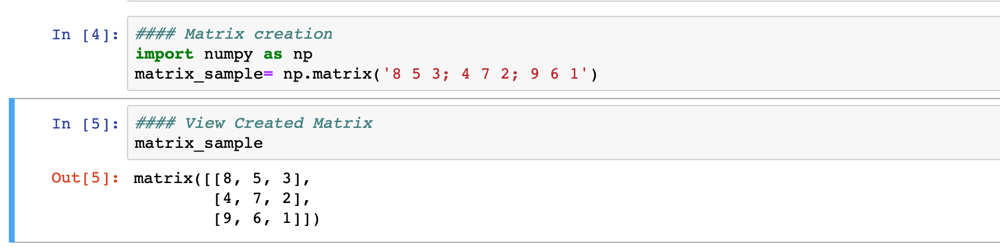
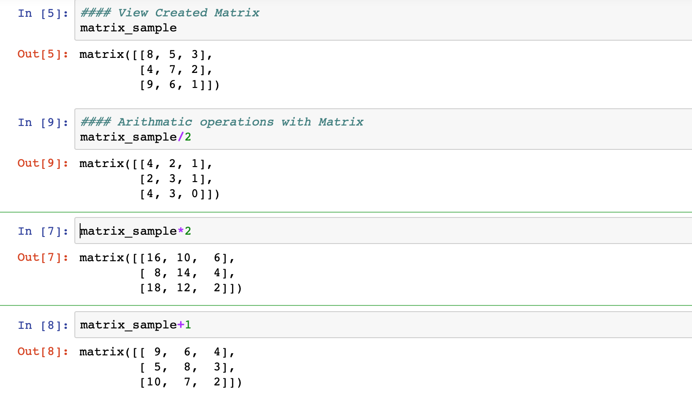
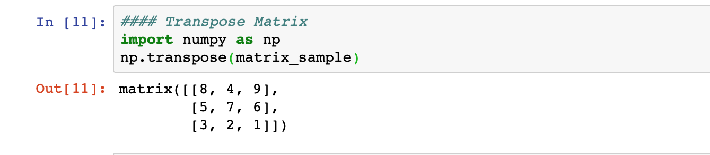
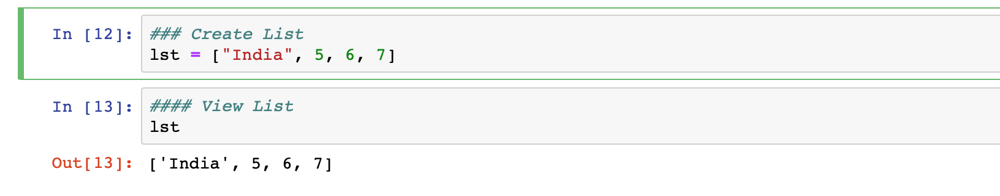
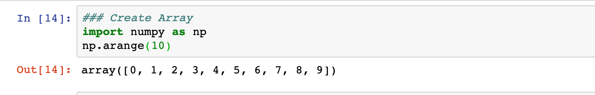
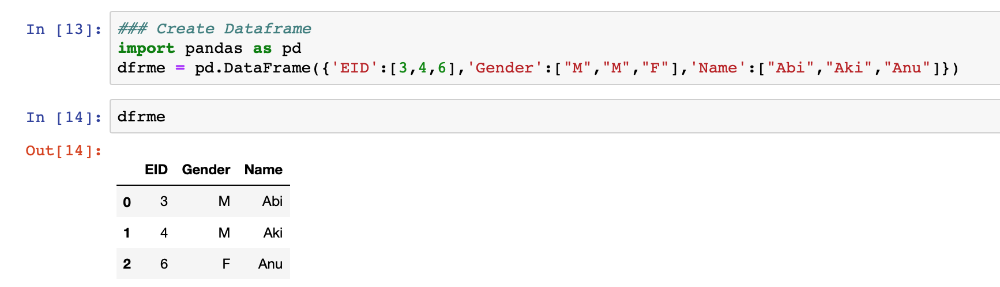
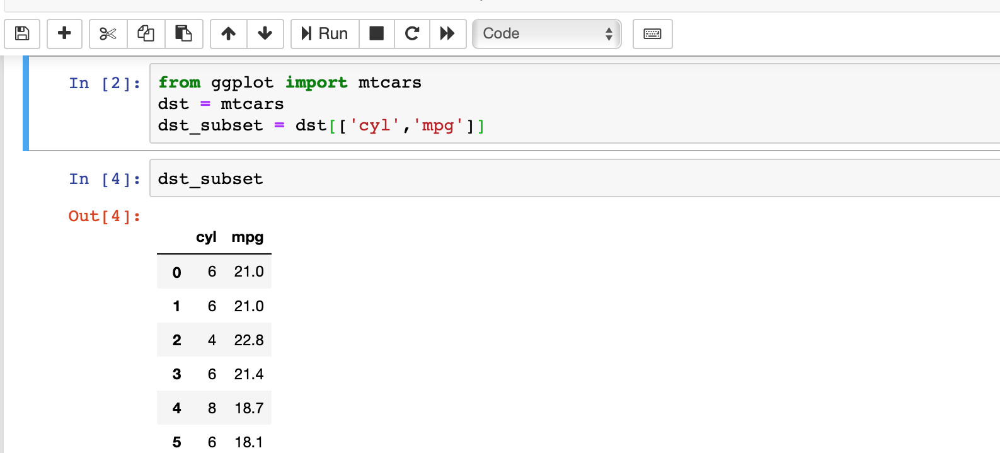

Continuing with matrix, list, array, dataframe creation.. 
Check this out...  
### Create Matrix
matrix_sample= np.matrix('8 5 3; 4 7 2; 9 6 1')   
### Output

### Arithmatic with matrices
matrix_sample/6    
matrix_sample*2   
matrix_sample+1   
matrix_sample-1   
### Output

### Transpose matrix
import numpy as np   
np.transpose(matrix_sample)   
### Output

### Create List
lst = ["India", 5, 6, 7]     
### Output

### Create array
import numpy as np    
np.arange(10)   
### Output

### Create Dataframe
import pandas as pd   
dfrme = pd.DataFrame({'EID':[3,4,6],'Gender':["M","M","F"],'Name':["Abi","Aki","Anu"]})    
### Output

### Create DataSet from existing dataset
from ggplot import mtcars    
dst = mtcars    
dst_subset = dst[['cyl','mpg']]  
### Output

I had issues while running command which had ggplot, i fixed it by installing separately and doing some config changes. Better you install latest conda version in which you may not get this issue.

