Here we go with next...Working with the mtcars dataset which we loaded before. Check the below screenshot for reference.  
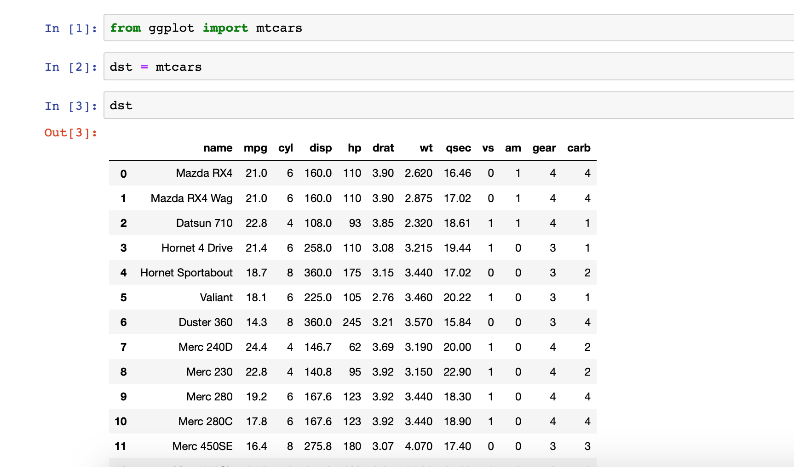
### Selecting rows with condition
dst_n1 = dst.loc[(dst['cyl'] == 6) | (dst['mpg'] == 21)]  Here we are selecting rows which has cyl = 6, and mpg = 21.    
### Output
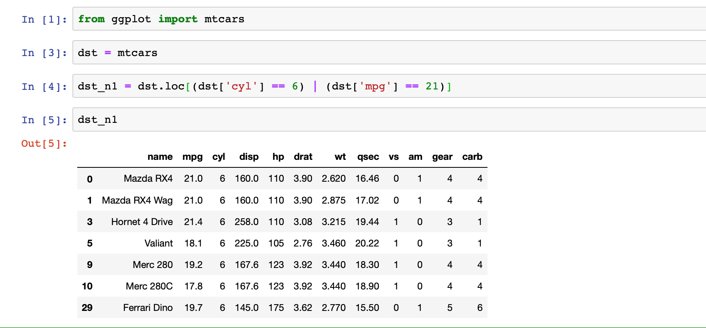
### Creating a new variable
import numpy as np    
dst['NwVar'] = np.log2(dst['cyl'])   
### Output
New Variable named 'NwVar' has been created in last column.  
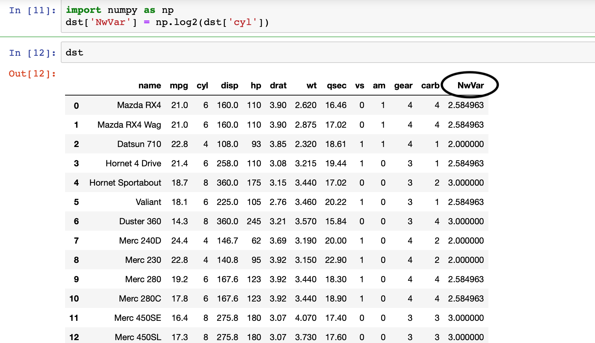
### Adding rows of data frame
import pandas as pd
df1 = pd.DataFrame({'a' : [1,2,3,4], 'b' : [4,5,6,7]})   
df2 = pd.DataFrame({'a' : [7,8,9,2], 'b' : [3,7,8,9]})   
df3 = df1.append(df2)  
### Output
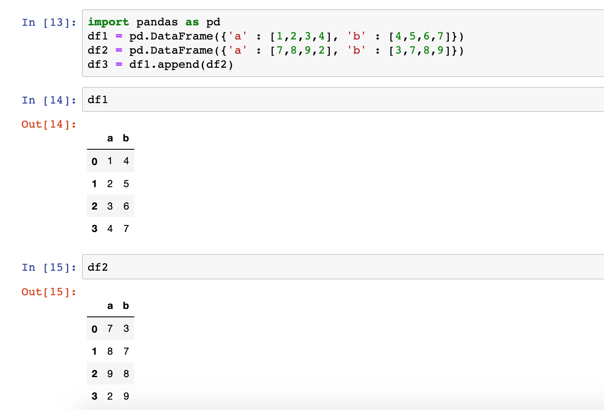
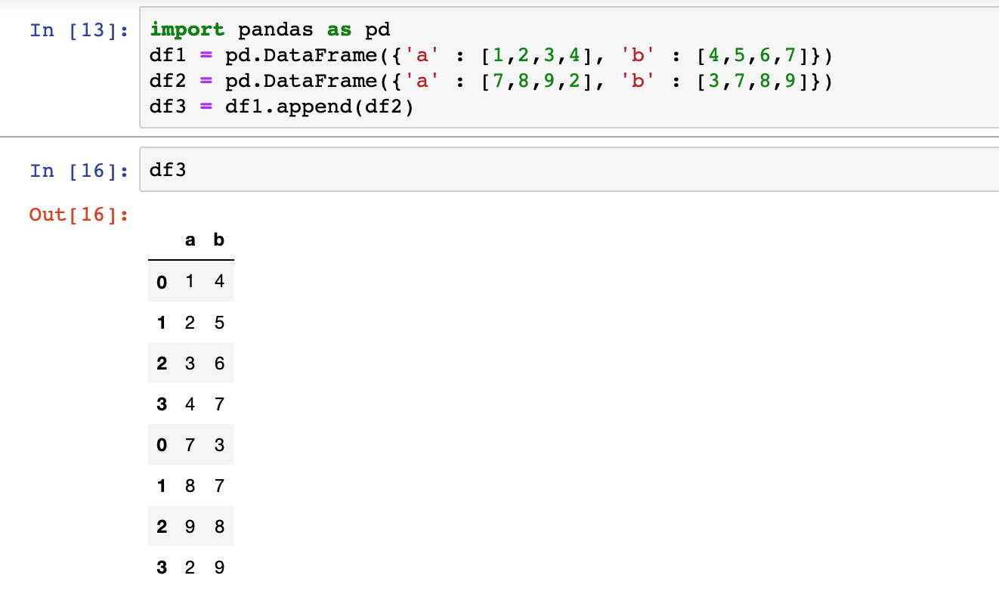
### Adding Columns
df3 = pd.concat([df1.reset_index(drop=True), df2], axis=1)  
### Output
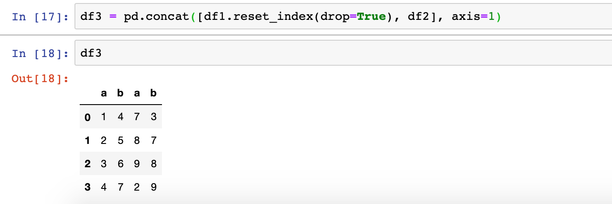
### Convert Variables
dt = mtcars
dt['cyl'] = dst['cyl'].astype(object)    
### Output
check the below screenshots where variable 'cyl' is mentioned as 'Int' and after converting it shows as 'Object'. 
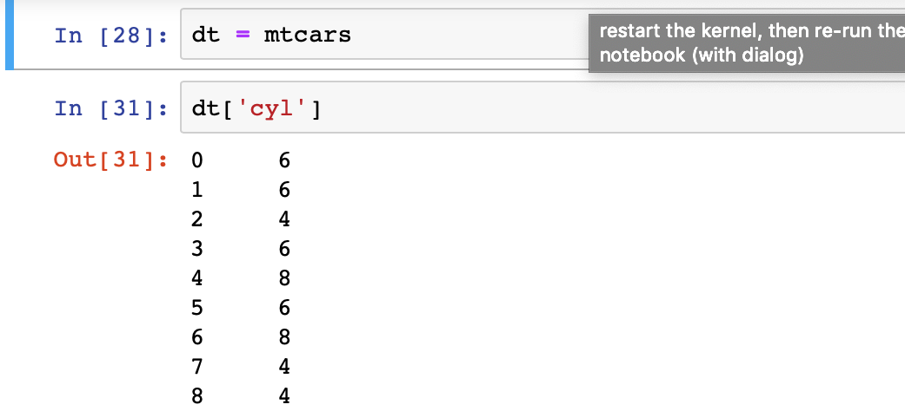
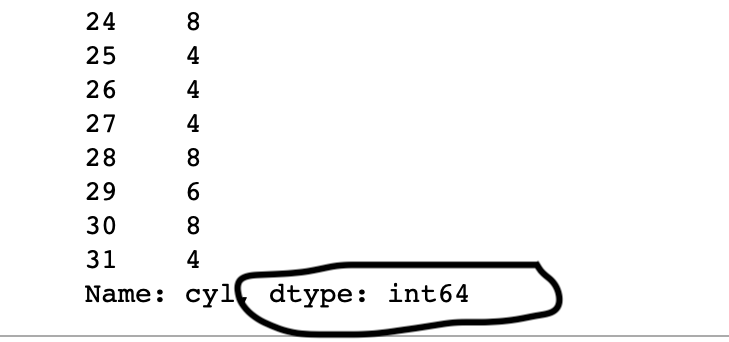
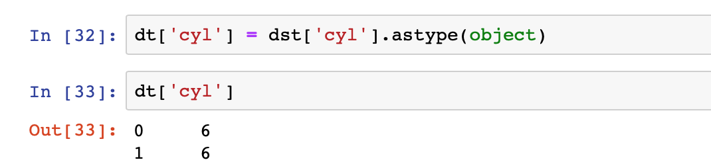
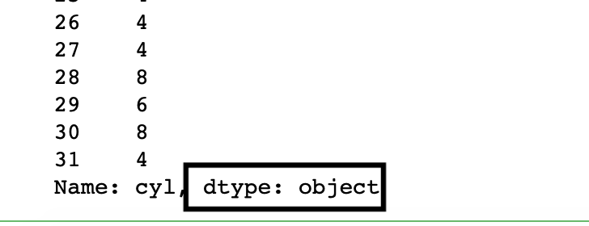
### Convert Entire Dataframe
dst = dst.astype(object)  
### Convert numeric to categorical/binning
dst['mpgcat'] = np.where(dst['mpg'] > 20, 'Low', 0)   
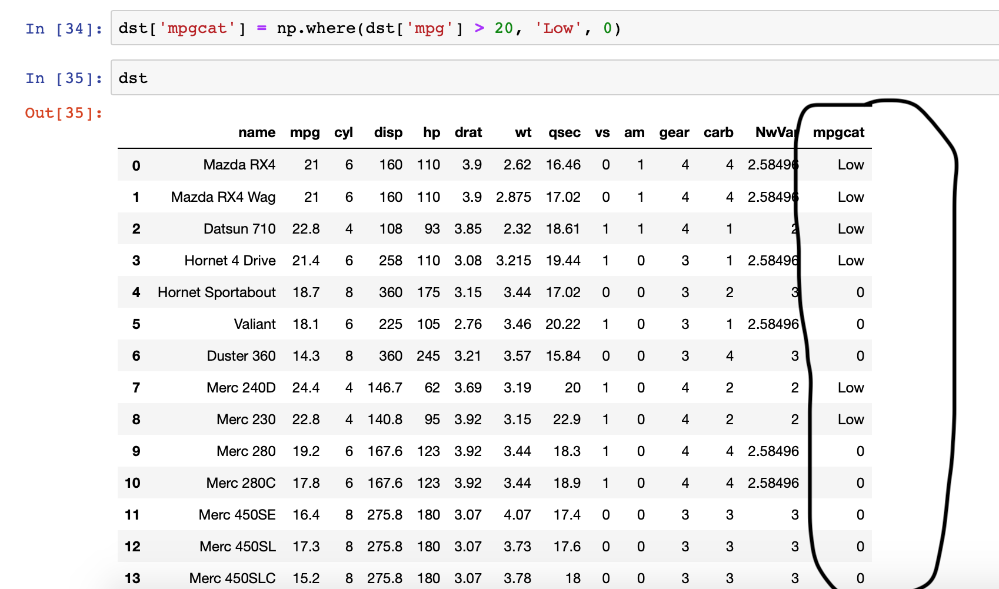
### Sorting - ascending order
dst = dst.sort_values('cyl', ascending = True)   
### Output
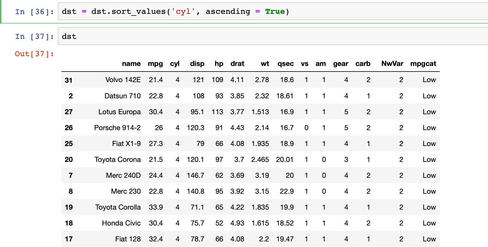
### Sorting - descending order
dst = dst.sort_values('cyl', ascending = False)   
### Output
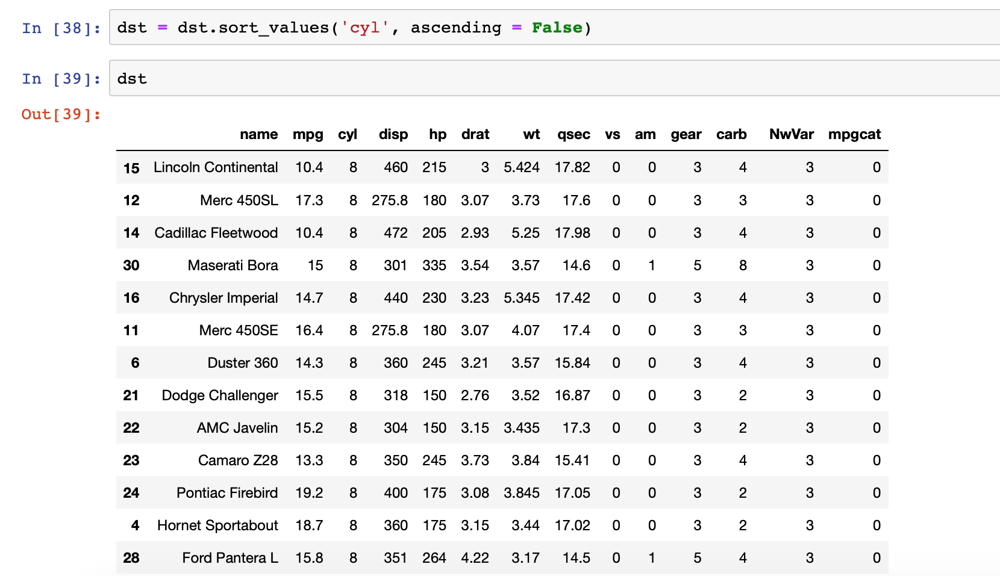

Will end up here and see the next in next.

