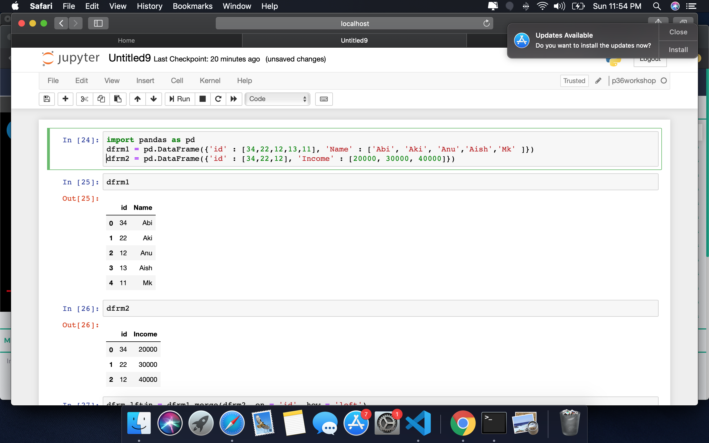
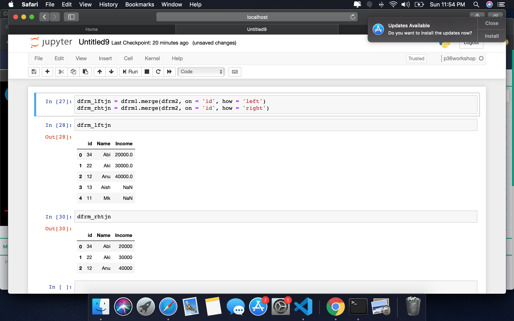

Check below commands. The next set...

### Merge Dataframes
import pandas as pd
dfrm1 = pd.DataFrame({'id' : [34,22,12,13,11], 'Name' : ['Abi', 'Aki', 'Anu','Aish','Mk' ]})  
dfrm2 = pd.DataFrame({'id' : [34,22,12], 'Income' : [20000, 30000, 40000]}) 
### Output

### Joins
dfrm_lftjn = dfrm1.merge(dfrm2, on = 'id', how = 'left')  
dfrm_rhtjn = dfrm1.merge(dfrm2, on = 'id', how = 'right') 
### Output

### Replace values in a variable
a = ("Everything will be alright")  
a.replace("will", "will defientely")  
### Output