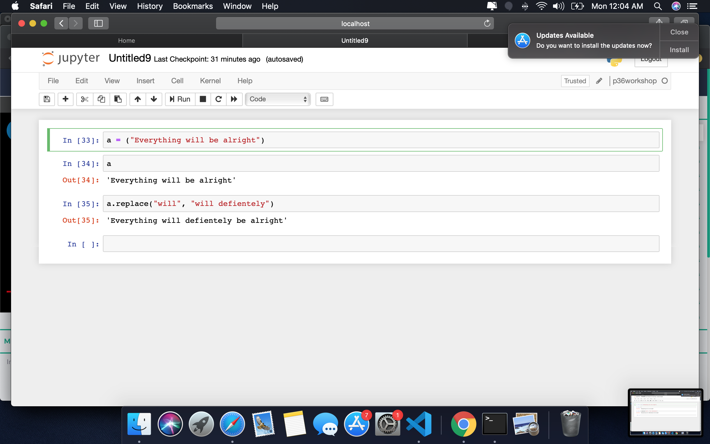
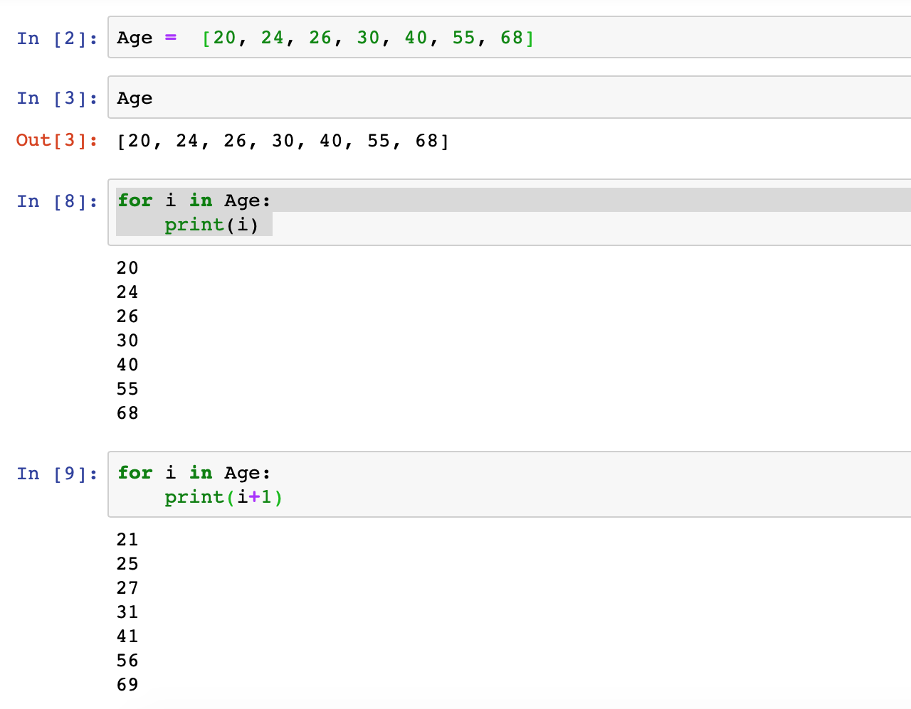
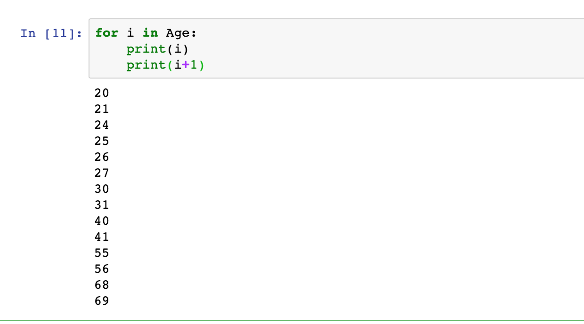
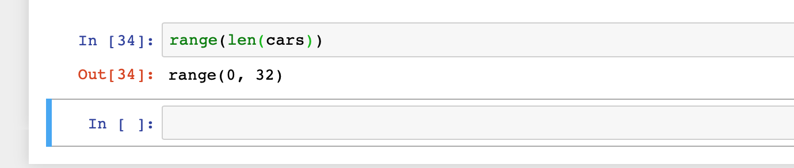
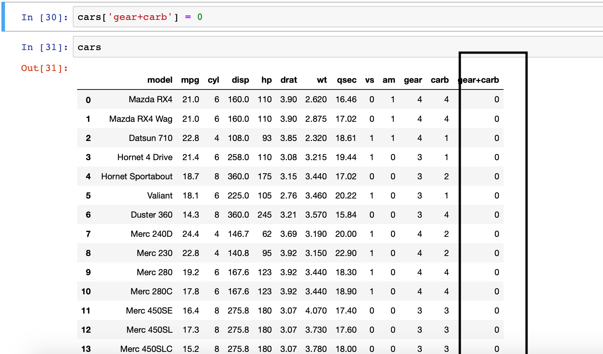
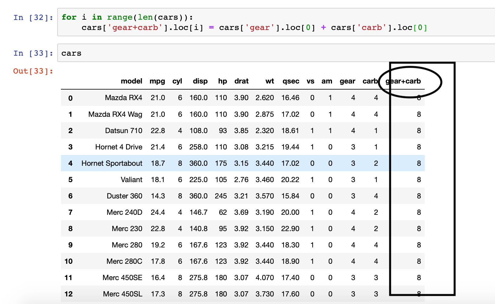

Check below commands. The next set...

### Merge Dataframes
import pandas as pd
dfrm1 = pd.DataFrame({'id' : [34,22,12,13,11], 'Name' : ['Abi', 'Aki', 'Anu','Aish','Mk' ]})  
dfrm2 = pd.DataFrame({'id' : [34,22,12], 'Income' : [20000, 30000, 40000]}) 
### Output

### Joins
dfrm_lftjn = dfrm1.merge(dfrm2, on = 'id', how = 'left')  
dfrm_rhtjn = dfrm1.merge(dfrm2, on = 'id', how = 'right') 
### Output

### Replace values in a variable
a = ("Everything will be alright")    
a.replace("will", "will defientely")    
### Output

### Create Vector & Sample Loop
Age =  [20, 24, 26, 30, 40, 55, 68]  
for i in Age  
    print(i)   
    print(i+1)  
Make sure print statement starts after a single space. Else Indentation error will occur.  
I have shown the output by running few commands..Check it 
### Output

### Loading csv and checking length 
import os  
import pandas  
os.chdir("/Users/mac/Desktop/new/Python")   
cars = pd.read_csv("mtcars.csv")   
range(len(cars))   // checking the lenghth
### Output
We have 0 to 32 rows in the cars object.  

### Adding new column using loop
We have columns named gear and carb in cars. Lets create a new variable named gear+carb which will be the sum of carb for every row. 
     //new column created initially as 0 
cars  //checking the new column 
 
for i in range(len(cars)):
    cars['gear+carb'].loc[i] = cars['gear'].loc[0] + cars['carb'].loc[0]

cars //checking finally
### Output

With this will end up python.. Lets execute the commands while we working on some projects and see how useful all these. Stay tuned for more important parts of Datascience which will be covered in upcoming posts.

