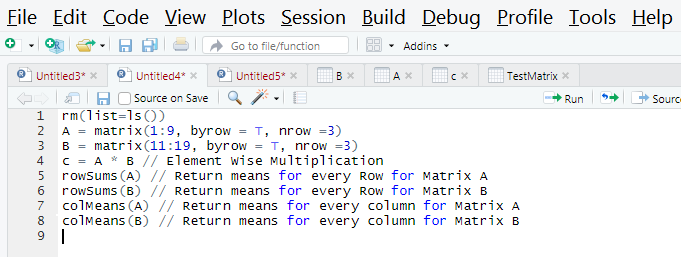

I thought of starting Advanced R, but there are more and more basic R Commands are still need to be covered. So we will go through the entire R Basic commands and will start with R Advanced. I have posted screenshot for every single command so that you will catch up with right syntax. Let us start!

What would be the first command as soon we open R Studio..
Yes!! It is rm(list=ls()) - Removing all objects stored in RAM.
Now set current working Directory using setwd command. Now start working on commands...

### Selecting Rows from Dataset
TempData = mtcars.
View(TempData).
TestData = subset(data, select = c("hp", "drat")).
View(TestData).
### Screenshot for above commands

#### Viewing TempData

#### Viewing TestData( After Extracting two variables)

### Selecting rows with condition
TestData1 = TempData[which(TempData$hp == 110),].
In Above Command, from TempData, we are selecting rows which has hp=110 value. As this is Row level operation we are leaving nothing after comma.
### Screesnhot for which command

### Viewing TestData1

### Command to create Matrix
TestMatrix = matrix(11:19, byrow = T, nrow =3) // This will arrange 11 to 19 by 3 rows. If we set byrow = F, it will arrange by column.
We can also mention number of column as ncol.
### Command And Output Screenshots when byrow = T

### Command And Output Screenshots when byrow = F

### Example for ncol and output

### Transpose Matrix- Command
TestMatrix = matrix(11:19, byrow = T, nrow =3)
View(TestMatrix)
t(TestMatrix) // t for transpose
### Screenshots for Transpose of a matrix

### Few more R commands on Matrix

### Command to create Vector
TestVector = c(11, 15, 18, 19)

Just wanted to explain the differnce between vector and matrix as i just browsed and understood, so that you dont need to waste your time on browsing to understand the same. Vector is a list of numbers and it can be either in row or column, whereas Matrix is an array of numbers with rows and columns.
### Vector Command and Output

Let us finish this page with above commands. There are more basic commands, i will update in my next blog post. 

