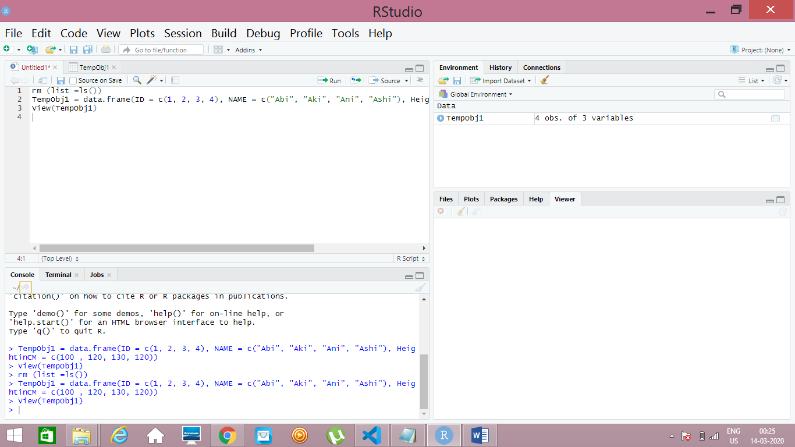
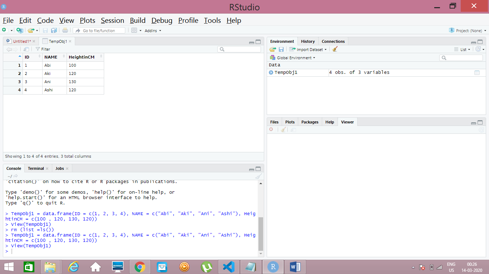
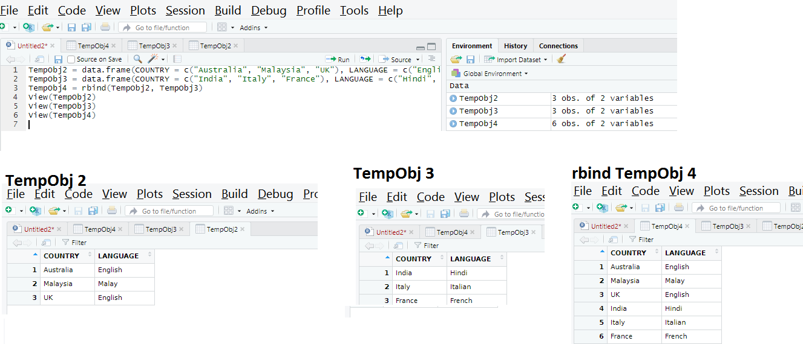
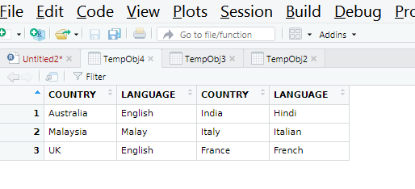
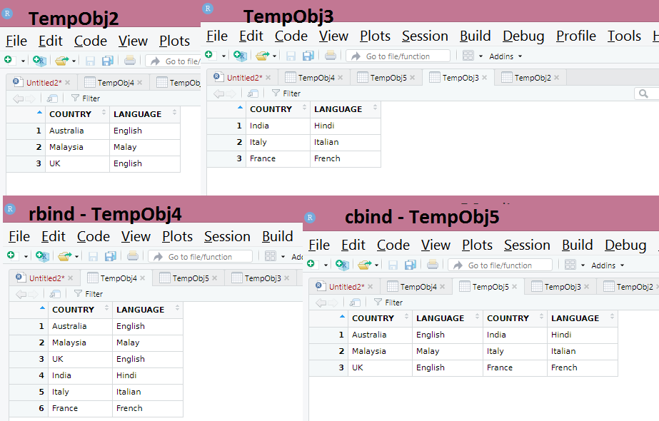
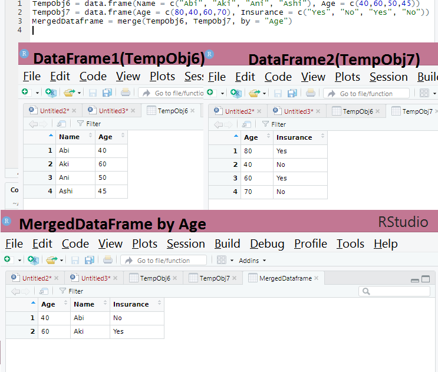

Find the next set of R commands on DataFrame. In Last post, we saw, how to create matrix and  vector, In this page we are going to work on dataframe. Before proceeding let us understand what is dataframe.  
Dataframe is a structure like table with rows and columns, whereas each column contains values of one variable and each row contains one set of values from each column. I will make it simple by explaining the difference between matrix and dataframe.   
Matrix has rows and columns where as it stores single datatype values,whereas dataframe stores different types of values in a single table. Example it stores numeric, character values in the single table.
### Create Data Frame
TempObj1 = data.frame(ID = c(1,2,3,4), NAME = c("Abi", "Aki", "Ani", Ashi"), HeightinCM = c("100", "120", "130", "120"))
 
#### Output for Data Frame Creation

### Adding rows and columns of two data frame
TempObj2 = data.frame(COUNTRY = c("Australia", "Malaysia", "UK"), LANGUAGE = c("English", "Malay", "English"))       
TempObj3 = data.frame(COUNTRY = c("India", "Italy", "France"), LANGUAGE = c("Hindi", "Italian", "French"))
#### Now Adding rows of above two data frame
TempObj4 = rbind(TempObj2, TempObj3)
#### Output of rowbind

#### Now Adding Colums of two data frame
TempObj4 = cbind(TempObj2, TempObj3)  
#### Output for Column bind
  
#### Rowbind and Columnbind in single picture

### Merge Operation in Data Frames
TempObj6 = data.frame(Name = c("Abi", "Aki", "Ani", "Ashi"), Age = c(40,60,50,45))  
TempObj7 = data.frame(Age = c(80,40,60,70), Insurance = c("Yes", "No", "Yes", "No"))  
MergedDataframe = merge(TempObj6, TempObj7, by = "Age")  
#### Output for Merge Operation

With this, we complete this page, two more posts will be on R basics. After that we will start with Advanced R. !!!!

