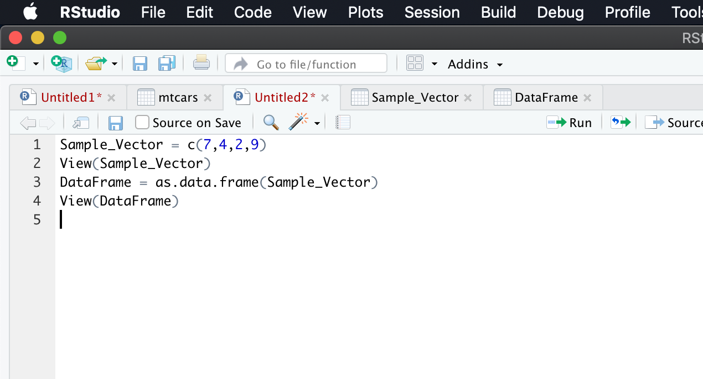
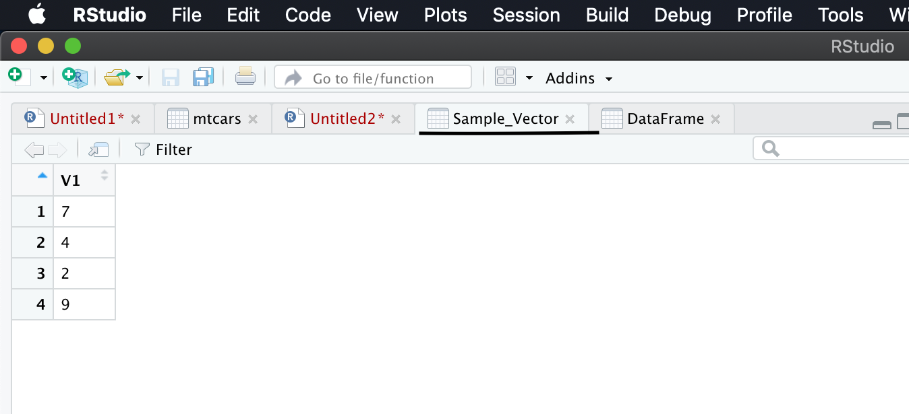
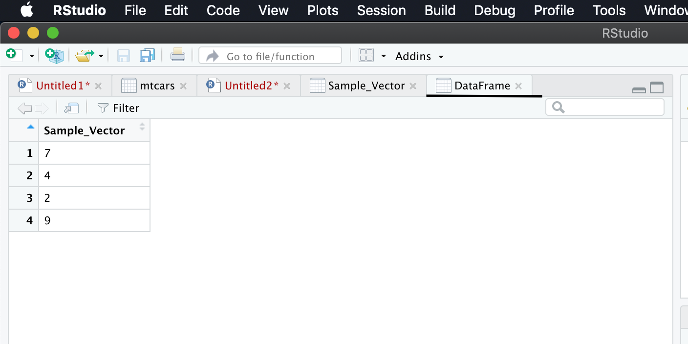
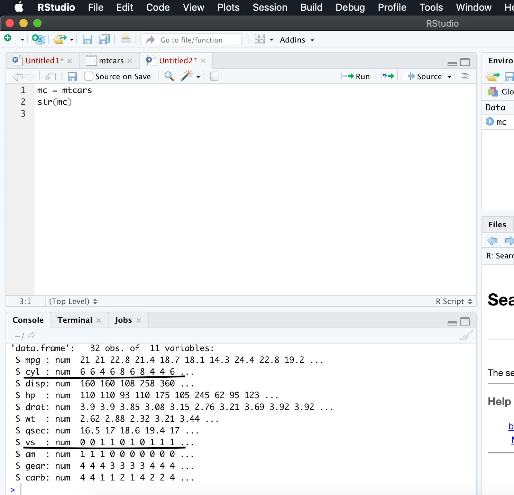
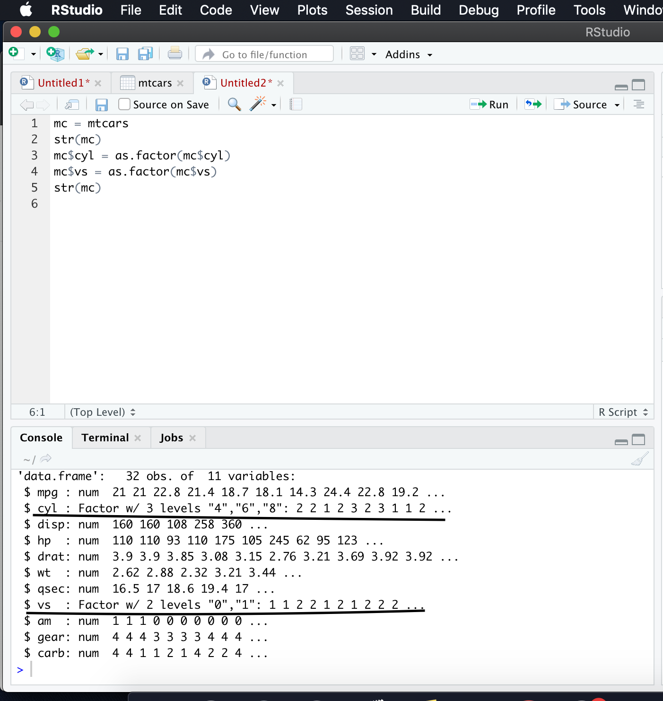
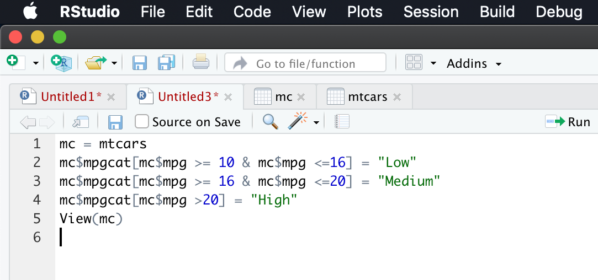
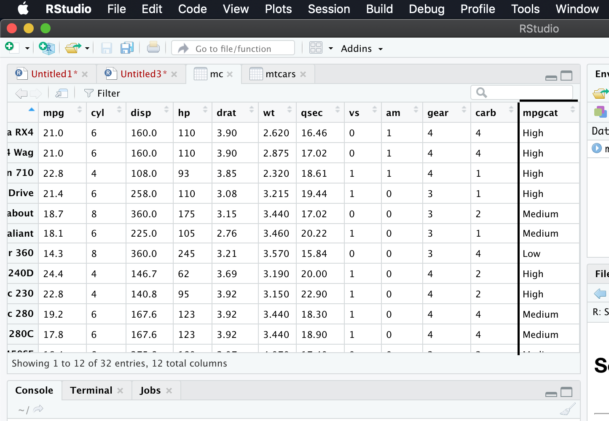
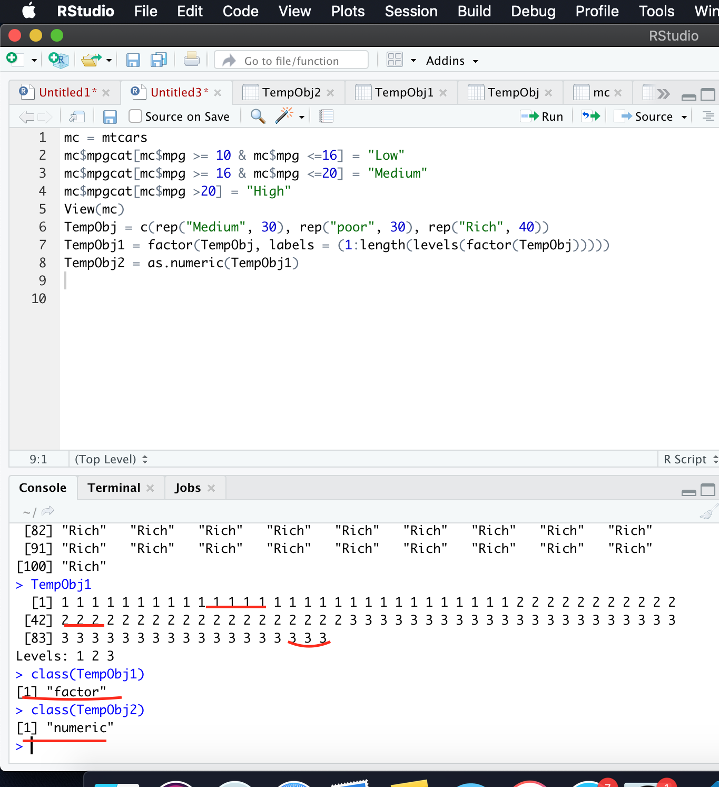

Here we go with next set of commands. In this page we will see datatype conversion. As we are going to handle with different types of data and we should also know how to convert from one type to another. Here we go!  
R has many datastructures. It includes
- Vector
- List
- Matrix
- Data Frame
- Factors
- Tables    
Now let us see how to do conversion
### Converting Vector to Data Frame
Sample_Vector = c(7,4,2,9)    
View(Sample_Vector)   
DataFrame = as.data.frame(Sample_Vector)      
View(DataFrame)     
#### Output for above commands in screenshot  
 
 
 
Now we will see how to convert from numeric to factor, numeric to categorical, categorical to numeric,
### Numeric to Factor conversion
mc = mtcars    
str(mc)      
mc$cyl = as.factor(mc$cyl)    
mc$vs = as.factor(mc$vs)   
str(mc)     
#### Output for above commands in screenshot  
 
  
### Numeric to Categorical conversion
mc$mpgcat[mc$mpg >= 10 & mc$mpg <=16] = "Low"    
mc$mpgcat[mc$mpg >= 16 & mc$mpg <=20] = "Medium"   
mc$mpgcat[mc$mpg >20] = "High"    
#### Output for above commands in screenshot
 
  
### Categorical to Numeric Conversion
TempObj = c(rep("Medium", 30), rep("poor", 30), rep("Rich", 40)) 
TempObj1 = factor(TempObj, labels = (1:length(levels(factor(TempObj)))))   
TempObj2 = as.numeric(TempObj1)     
#### Output for above commands in screenshot 
   

With this we will end up Basics R, From next, we will start with Advanced R!..

