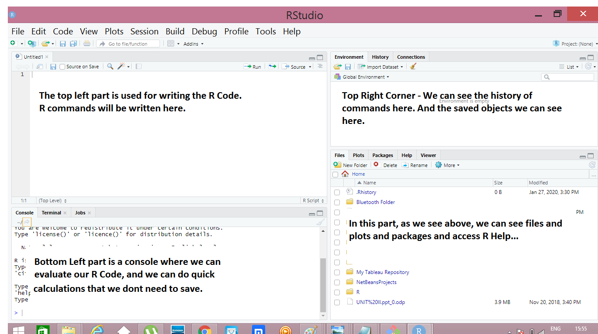
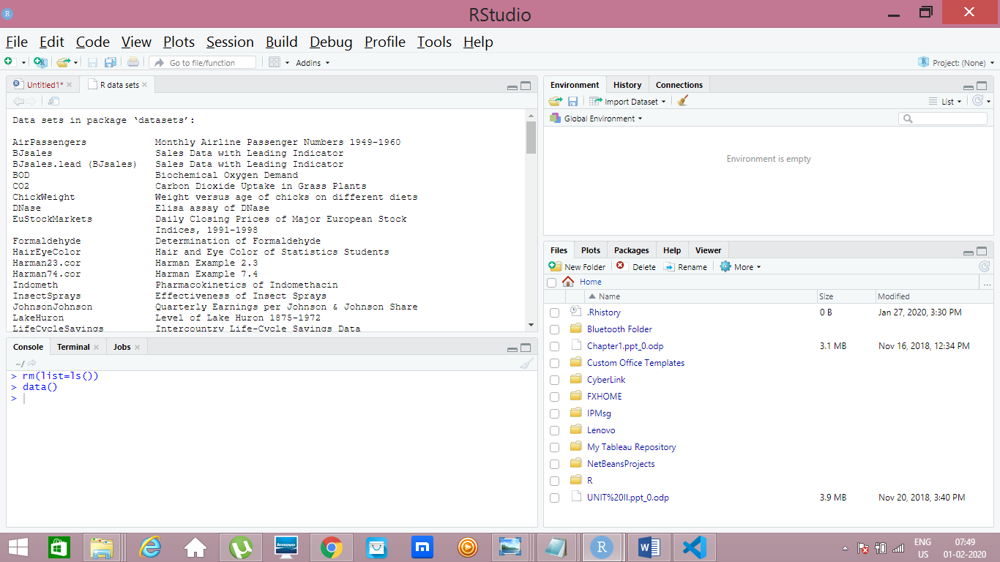
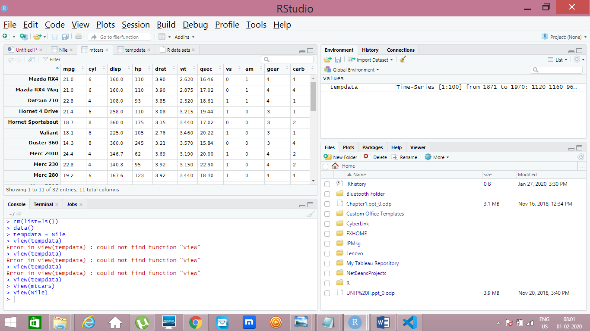
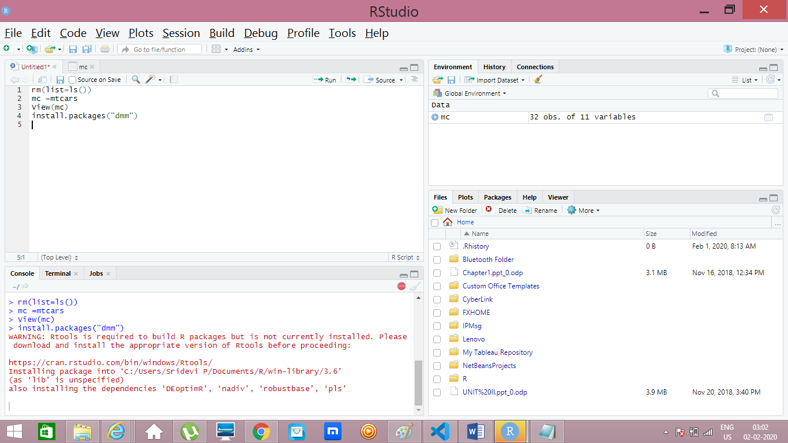
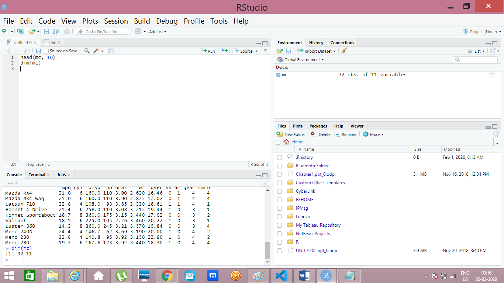
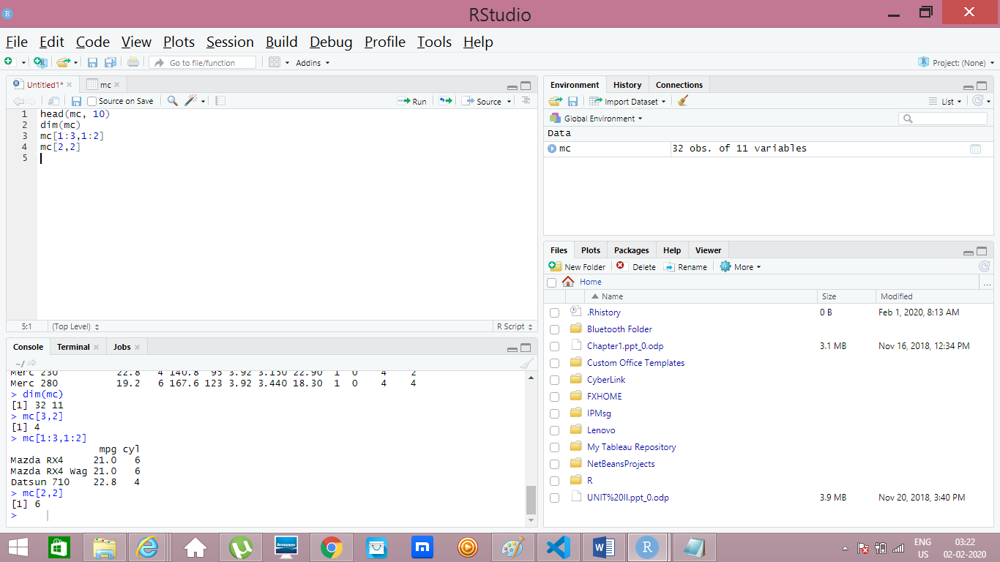
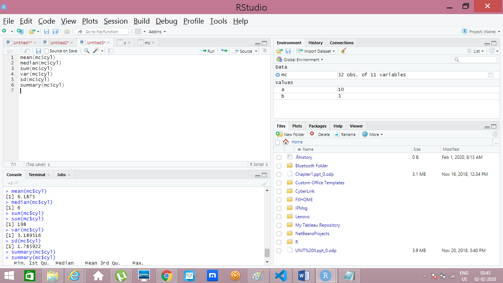

R! R is a OpenSource Programming Language and Domain Specific, Used for Statistical computing and Graphical Methods. R includes Machine Learning Algorithm and Linear Regression. In R, we do data analysis and Develop ML Model and drive the conclusion. It handles lighter Datasets, Datasets with high volume of rows and columns, will be better handled by Python.

About R, and How it got introduced, all theory you can get in the internet. Now let us start with essential part which is needed for our DataScience learning.
### R Installation
- R Installation consists two parts
- Installation of R
- Installation of R Studio //
We should install R before R Studio.
### Difference between R and R Studio
- R is a programming Language
- R Studio is a Integrated Devlopment Emvironment (IDE) basically, the platform for developing/ Running programs in R.
- We have others IDEs like Eclipse, Visual Studio, which can work as a platform for R. Widely used is R Studio.
### R/ R Studio Installation
As we all well grown professionals, I am just giving the link here for R and R Studio, where you can download suitable version for your OS, and install it just by giving next next..
#### Link for downloading R
link- https://cran.r-project.org/bin/windows/base/
#### Link for downloading R Studio
Link- https://rstudio.com/products/rstudio/download/
- After installing R and R Studio, just open R Studio, which has four parts in the GUI, which is explained below in this picture

Now Let us move to R Programming!!!
### R Commands
You can start writing the R code, in the R Studio top left corner, which is mentioned in above picture.R has few dafault datasets. We will work with that dataset first and then we will learn how to load a new dataset next.
- The first operation in R should be clearing exising objects in RAM. As R operates in RAM, we need to clear memory as and when to make memory free and run the program faster.
- R runs one program at a time.
- To Run a command give ctrl+Enter or click on the Run in the panel.
- Please be remembered to give ctrl+Enter after every command to make it Run else give Run in the panel. You can View the output in the console.
- For every command I have posted the output picture so that we can get it easier....
- For Every Picture- Look Top Left for Commands.
- Bottom left for Output in Console.
#### Removing Objects
rm(list=ls())
#### Command to see the pre loaded datasets in R
data()
##### Output

#### View Command 
View(mtcars)
- Here I am seeing existing dataset. 
##### View-Output for mtcars

#### Assigning dataset to temporary object
mc = mtcars 
- Here mc is a temporary object and mtcars is preloaded dataset.
- Hereafter we can use mc instead of mentioning mtcars.
View(mc) // Viewing mtcars using the temp object
#### Command to Install Packages
install.packages("dmm") // dmm is the package name here
- We can use Tools->Install Packages option which is in the menu bar.

You need to be connected to the Interet to install any packages.
#### Useful commands to work on Dataset
- head(mc, 15) //lists top 15 rows of the dataset(mtcars) in the console
- tail(mc, 3)  //lists first 3 columnes of the dataset(mtcars)
- dim(mc) //gives dimension of the dataset, (number of rows and columes)

#### Extract Specific Data based on Rows and Columes
Suppose if you want to see, first 3 rows and two columes the command is below
- mc[1:3,1:2] // Provides first 3 rows and 2 columes
- mc[3,2]  // Provides 3rd row and 2nd column's value.

- mc[1:5,] //Select first 5 rows and all columnes
#### Some Arithmetic Operations
- a <- 10 //assigning 10 to tempobj a
- b <- 3  //assiging 3 to tempobj b
- c <- a + b //Now adding the values and assigning the output to C.
- print (paste(c)) // Printing the value of C

You can also, directly enter the values and get the operations done.
#### Example
- 6 + 6 // Addition
- 10 -2 //Subtraction
- 2 * 4 //Multiplication
- (10)/2 //Division
- 8^2 //Squaring

#### Mean Median Calculation
I have taken one column named "cyl" in the preloaded dataset mtcars which is assigned to the object named "mc".
- mean(mc$cyl) //Provides mean. ($ - to select particular variable/column) 
- median(mc$cyl) //Provides median of column "cyl"
- sum(mc$cyl) //Provides sum of all values of cyl.
- var(mc$cyl) //Provides variance
- sd(mc$cyl) //Provides standard deviation
- summary(mc$cyl) //provides summary where you can see mean, median and other details.
Commands and Output in Picture below.

There are few more basic commands which will be covered in next post.
Stay tuned!!!!
