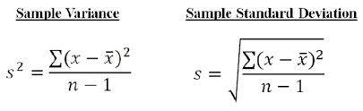

In previous page we saw about Mean, Median, Mode. In this page, we are going to see about 
- Variance
- Standard Deviation 
and some below statistical measures which is necessary when we do data analysis.
- Correlation
- Covariance
- Collinearity

We can understand all these techniques better when we apply practically in DataSets. 

### Variance
Variance describes how much a random variable differs from its expected value. Informally, it measures how far a set of (random) numbers are spread out from their average value. 

I will create a separate post on how to calulate Mean, Median, Mode , Variance, Standard deviation with examples. So that we can easily understand. Now try to get this theoretical part and its formula.

### Standard Deviation
It is a measure of the amount of variation or dispersion of a set of values. SD (Standard Deviation), also represented by the lower case Greek letter sigma σ for the population, or the Latin letter s for the sample standard deviation.

### Variance and Standard Deviation for Population

### Variance and Standard Deviation for Sample

### Covariance
Covariance is a statistical measure that is used to determine the relationship between the movement of two variables in a data set. Higher this value, more dependent is the relationship. A positive number signifies positive covariance and denotes that there is a direct relationship. 
Effectively this means that an increase in one variable would also lead to a corresponding increase in the other variable provided other conditions remain constant. On the other hand, a negative number signifies negative covariance which denotes an inverse relationship between the two variables. It can take any value from -∞ to +∞. Though covariance is perfect for defining the type of relationship, it is bad for interpreting its magnitude.
Covariance can not be applied for datasets or variables with different scales. For example, when you draw a connection line between height and distance, height will be in ft and distance will be in km, when you get covariance value 3000, We may not know whether it is strongly related or Medium related.To avoid this, we have correlation which is explained below in detail

       
## Correlation
Unlike covariance, the correlation has an upper and lower cap on a range. It can only take values between +1 and -1. A correlation of +1 indicates that random variables have a direct and strong relationship.
On the other hand, correlation of -1 indicates that there is a strong inverse relationship and an increase in one variable will lead to an equal and opposite decrease in the other variable. 0 indicates that the two numbers are independent.

### Difference between covariance and correlation
### Covariance
covariance varies from -infinity to +infinity
It provides direction of relationship 
It is dependent on scale of variables
It shows how much two variables vary together

### Correlation
correlation varies from -1 to 1
It provides direction and strength of relationship
It is independent of scales of variables
It shows how much two variables are strongly connected.

The Main Difference is correlation explain how strong the relation between variables, whether Medium, Strong, or low. 

### Importance of covariance and correlation
They both, covariance and correlation help in identifying the dependency between variables. Mainly used in banking and finance sectors. To develop any  Model, we need variables, and these two help in identifying the dependency between variables, which helps in reducing variables carrying same or dependent information. 

Say for example if we have ten variables and we send all ten variables  for Model, then Model will become more complex, so to save time, complexity, if we have any redundant variables,or any variables which are highly correlated, then we can remove one, if they two carrying same information.

### Collinearity
Collinearity is a condition in which some of the independent variables are highly correlated. 

### Difference between Correlation and Collinearity
Correlation is an operator, meaning that we can talk about the correlation between height and weight. The correlation can be positive, negative, or 0.

Collinearity is a phenomenon related to regression, in which some of the predictor variables are highly correlated among themselves. This makes one or more of these variables redundant in our analysis.

### MultiCollinearity
MultiCollinearity is a type of collinearity. Multicollinearity exists when independent variables are highly correlated. 

### Handling Multicollinearity
- Remove some of the highly correlated independent variables.
- Linearly combine the independent variables, such as adding them together.
- Perform an analysis designed for highly correlated variables, such as principal components analysis or partial least squares regression.

With this we are done with this page, and ...

Next Post is about below statistical techniques.
- ANOVA
- Chi Square Test
- Hypothesis Testing

