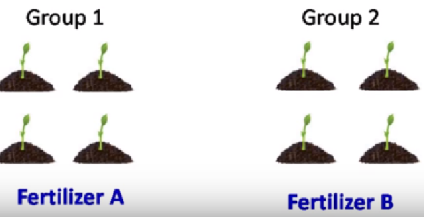
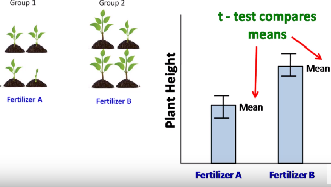
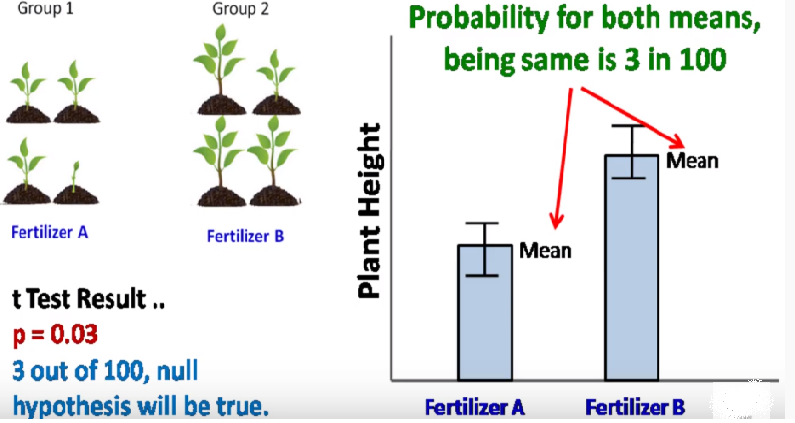
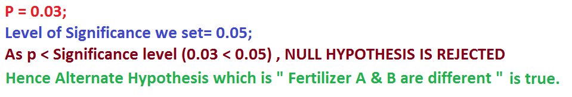
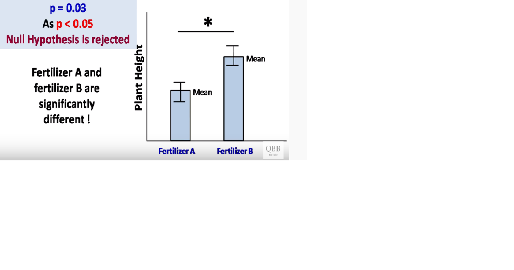
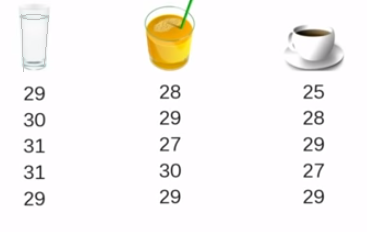
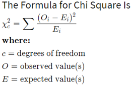

In This page, we will see about some statistical technique like 
- Hypothesis Testing
- ANOVA ( Analysis of Variance)
- Chi Square Test
### Uses of above Techniques in DataScience
we apply these techniques on data 
- To understand the data flow. 
- To understand the data better. 
- To understand the different types of variable.
### Hypothesis Testing
Hypothesis is nothing but guess or Assumption. When we get a dataset, we will develop some assumption or guess on the data. A statistical hypothesis is an assumption about the population parameter. There are two types Of statistical hypothesis.
- Null hypothesis
- Alternate hypothesis
- Null Hypothesis is denoted by H0 and Alternate Hypothesis is denoted by H1.
### Hypothesis Testing steps
Below are the steps which is being performed to carry out Hypothesis Testing
#### Step 1: Specify the Null Hypothesis
- The null hypothesis is a commonly accepted fact. 
#### Step 2: Specify the Alternative Hypothesis
- This is the opposite of the null hypothesis
#### Step 3: Set the Significance Level (a)
- This is the determiner, also known as the alpha (α)
- Before starting the experiment we decide the significance level.
- It can be any value from 0 to 1.
- The significance level, is the probability of rejecting the null hypothesis when it is true. 
- A significance level of 0.05 indicates a 5% risk of concluding that a difference exists when there is no actual difference.
- In simple words if significance level is 0.05 then, there is 5% chance of rejecting Null Hypothesis.
#### Step 4: Calculate the Test Statistic and Corresponding P-Value
- P Value is calculated using statistical Technique like t-Test, F-Test, ANOVA.
- P can be any value from 0 to 1.
- If we P value is higher than the significance level, then Null Hypothesis is accepted.
- If P Value is lesser than the significance level, then Null Hypothesis is rejected.
- For Example, If p=0.1, then 10 out of 100, null Hypothesis will be true.
- If p=0.3, then 30 out of 100, null Hypothesis will be true.
#### Step 5: Drawing a Conclusion
- Once we come to know which is true, whether Null or Alternate Hypothesis, we will come to the conclusion.
### Hypothesis Testing Example
#### Experiment:

- In above picture, Group 1 plants are being grown using Fertilizer A.
- Group 2 plants are being grown using Fertilizer B.
#### Step 1: Specify the Null Hypothesis
- Here Null Hypothesis is : NO DIFFERENCE BETWEEN FERTILIZER A & B
#### Step 2: Specify the Alternative Hypothesis
- Here ALternate Hypothesis is : FERTILIZER A & B ARE DIFFERENT.
#### Step 3: Set the Significance Level (a)
- Before starting the experiment we decide the significance level.
- It can be any value from 0 to 1.
- Here Let us decide the significance level as 0.05. (5%)
#### Step 4: Calculate the Test Statistic and Corresponding P-Value

#### Statistic Test 

#### P Value Calculation

#### Conclusion

Whenever we develop the assumption on the data, we need to validate whether the assumption is true or not. Here we validate with statistical Technique, to identify H0(Null hypothesis) or H1(Alternate Hypothesis), which is true.
I Believe, you got it now..explained better!!!!
## Different Statistical Technique
- Correlation Analysis 
- ANOVA
- Chi Square Test
### Correlaion Analysis
It is a statistical Technique to understand whether the variables are related and if related, how strong the variables are related. To do this analysis, we go for Correlation Analysis. In Simple terms it is used to measure the strength of a relationship between two variables.
### Example
- Correlation coefficient of Gold versus Dollar has a strong negative relationship. ( Increase in Dollar predicts a decrease in Gold Price)
- We have seen correlation in our previous page, so let us move to next topic. 
### ANOVA
- ANOVA is a commonly used statistical Test. 
- ANOVA = Analysis of Variance
- ANOVA is used to compare differences of means among more than 2 groups. It does this by looking at variation in the data and where that variation is found. 
- Specifically, ANOVA compares the amount of variation between groups with the amount of variation within groups.
- In ANOVA, we use one categorical variable and one Numerical Variable.
### Types of ANOVA
- One Way Test (One-way ANOVA between groups: used when you want to test two groups to see if there's a difference between them.)
- Two Way Test (Two way ANOVA without replication: used when you have one group and you're double-testing that same group.)
### Example
We have a two variables 
- Categorical Variable which has values Milk, Juice, Coffee. 
- Numberical Variable related to Milk, Juice, Coffee.
- We calculate Mean for the Numeric values of the variables Milk, Juice, Coffee.

- And then we go for a Hypothesis
- H0- All the Mean are equal
- H1- Means are different
### ANOVA FORMULA

### ANOVA EXPLANATION

### In Above Picture, 

As of now, get this theoretical basics, and in my next post i will explain it with an example, which will explain this theory part better.
### Chi Square Test
- We have two types here
- One is Chi Square Goodness of Fit - determines whether sample data matches the population.
- Second one is Chi Square Test for Independence- It tests to see whether distributions of categorical variables differ from each other.
- In Chi Square Test we deal with Two Categorical Variable. This test is applied when we have two categorical variable from single population (DataSet).
### Example
- We have two variables, Gender and Credit card spending.
- In Gender we have values (Male, Female). In Credit card spending we have values(Low, Medium, High).
- Now Hypothesis Comes into picture which is below
- H0- Gender and CC spending rate are dependent
- H1- Gender and CC spending rate are independent
(Just checking whether the Gender is having an impact on CC Spending)
- Calculating p and analysing the data further will help us to understand the data better. 
- The reason for calculating dependencies between variables, is when two variables are carrying same info, then sending both to ML model will lead to complexity. 
- To avoid this we are doing all our analysis in previous stages itself.
### Formula for Chi Square Test

We will start with R from next blogpost, Meanwhile i will prepare a Video content explaining all these using example, so that you all can get it clear more than text. 

Stay Tuned For R!!!!!
